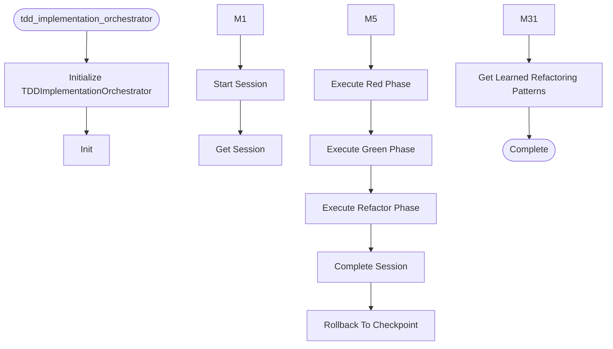

# Tdd Implementation Orchestrator

**Author:** Asif Hussain | **Copyright:** © 2024-2025 Asif Hussain. All rights reserved.

---

## Overview

TDD Implementation Orchestrator

Orchestrates Test-Driven Development workflow with RED→GREEN→REFACTOR phases
and clean code enforcement. Enforces quality during REFACTOR phase with
duplicate detection, SOLID validation, and holistic code review.

Key Features:
- Phase-based TDD workflow (RED → GREEN → REFACTOR)
- Test-first validation (tests must fail before implementation)
- Minimal implementation guidance (tests pass with simplest code)
- Holistic REFACTOR phase (duplicates, redundancies, SOLID principles)
- Scope-aware quality checks (implementation files only)
- Out-of-scope blocker detection (log, don't fix)
- Git checkpoints at phase boundaries (rollback capability)
- Pattern learning (stores refactoring preferences in Tier 2)
- Real-time metrics (dashboard integration)

Usage:
    from src.orchestrators.tdd_implementation_orchestrator import TDDImplementationOrchestrator
    
    orchestrator = TDDImplementationOrchestrator(project_root="path/to/project")
    
    # Start TDD session
    session = orchestrator.start_session(
        feature_name="User Authentication",
        task_id="FEATURE-001"
    )
    
    # Execute RED phase
    red_result = orchestrator.execute_red_phase(session_id=session["session_id"])
    
    # Execute GREEN phase
    green_result = orchestrator.execute_green_phase(session_id=session["session_id"])
    
    # Execute REFACTOR phase (the innovation)
    refactor_result = orchestrator.execute_refactor_phase(session_id=session["session_id"])

Author: Asif Hussain
Copyright: © 2024-2025 Asif Hussain. All rights reserved.
License: Source-Available (Use Allowed, No Contributions)
Version: 1.0.0 (CORTEX 3.8.2)

## Workflow

## Class: TDDPhase

TDD workflow phases (DEPRECATED - use session_model.TDDPhase).

**Inherits from:** Enum

## Class: TDDSessionState

State tracker for TDD session (MIGRATED to session_model.TDDSession).

This class now inherits from TDDSession for type safety and consistency.
Maintains backward compatibility with existing code.

**Inherits from:** TDDSession

### Methods

#### `__init__(self, session_id, feature_name, task_id, work_item_id)`

#### `transition_to(self, new_phase, checkpoint_id)`

Transition to new phase with history tracking.

Uses validation framework to ensure valid transitions.

Args:
    new_phase: Phase to transition to (old enum)
    checkpoint_id: Optional checkpoint ID for rollback

#### `can_transition_to(self, target_phase)`

Validate if transition to target phase is allowed.

Now uses validation framework for consistent rules.

Args:
    target_phase: Phase to validate transition to
    
Returns:
    Tuple of (allowed, reason)

#### `to_dict(self)`

Convert state to dictionary for persistence (uses parent serialization).

## Class: TDDImplementationOrchestrator

Orchestrates TDD workflow with clean code enforcement.

Manages RED→GREEN→REFACTOR cycle with:
- Test-first validation (RED phase)
- Minimal implementation (GREEN phase)
- Holistic refactoring (REFACTOR phase - THE INNOVATION)
- Git checkpoints at boundaries
- Pattern learning (Tier 2 integration)
- Real-time metrics (dashboard integration)

### Methods

#### `__init__(self, project_root, cortex_root, enable_pattern_library)`

Initialize TDD Implementation Orchestrator.

Args:
    project_root: Root directory of project being developed
    cortex_root: Root directory of CORTEX (defaults to auto-detect)
    enable_pattern_library: Enable Tier 2 pattern learning (default: True)

#### `_detect_cortex_root(self)`

Auto-detect CORTEX root from current file location.

#### `start_session(self, feature_name, task_id, work_item_id, test_files, require_tests_upfront)`

Start a new TDD session.

TIER 0 ENFORCEMENT: By default, requires test file paths to enforce test-first.

Args:
    feature_name: Name of feature being implemented
    task_id: Optional task identifier
    work_item_id: Optional ADO work item ID
    test_files: Test files that MUST exist before RED phase (test-first enforcement)
    require_tests_upfront: If True, blocks session start until test files specified
    
Returns:
    Dict with session_id and initial state

#### `get_session(self, session_id)`

Get active session state.

Args:
    session_id: Session identifier
    
Returns:
    TDDSessionState or None if not found

#### `_save_session_state(self, state)`

Persist session state to disk.

Args:
    state: Session state to save

#### `_validate_phase_transition(self, session_id, target_phase)`

Validate phase transition is allowed.

Args:
    session_id: Session identifier
    target_phase: Target phase to transition to
    
Returns:
    Tuple of (allowed, reason, state)

#### `execute_red_phase(self, session_id, test_command, test_files)`

Execute RED phase: Verify tests fail before implementation.

TIER 0 ENFORCEMENT: Tests MUST be written and failing before implementation.

Args:
    session_id: TDD session identifier
    test_command: Optional test command (auto-detected if not provided)
    test_files: Optional list of test files to validate (enforces test-first)
    
Returns:
    Dict with success, message, test results

#### `execute_green_phase(self, session_id, test_command)`

Execute GREEN phase: Verify tests pass after minimal implementation.

Args:
    session_id: TDD session identifier
    test_command: Optional test command (auto-detected if not provided)
    
Returns:
    Dict with success, message, test results, coverage delta

#### `execute_refactor_phase(self, session_id, auto_apply)`

Execute REFACTOR phase: Holistic code quality analysis and cleanup.

THIS IS THE INNOVATION - Enforces clean code/architecture.

Args:
    session_id: TDD session identifier
    auto_apply: If True, apply safe refactorings automatically
    
Returns:
    Dict with success, message, refactorings, metrics

#### `complete_session(self, session_id)`

Complete TDD session and generate summary.

Args:
    session_id: Session identifier
    
Returns:
    Dict with success, summary, metrics

#### `rollback_to_checkpoint(self, session_id, checkpoint_id)`

Rollback to previous checkpoint.

Args:
    session_id: Session identifier
    checkpoint_id: Checkpoint to rollback to
    
Returns:
    Dict with success, message

#### `_run_tests(self, test_command)`

Run tests without coverage.

Args:
    test_command: Optional test command (auto-detected if not provided)
    
Returns:
    Dict with test results

#### `_run_tests_with_coverage(self, test_command)`

Run tests with coverage tracking.

Args:
    test_command: Optional test command (auto-detected if not provided)
    
Returns:
    Dict with test results and coverage

#### `_detect_test_command(self, with_coverage)`

Auto-detect test command based on project structure.

Args:
    with_coverage: Whether to include coverage flags
    
Returns:
    Test command string

#### `_parse_test_output(self, output)`

Parse test output to extract pass/fail counts.

Args:
    output: Test command output
    
Returns:
    Tuple of (passed, failed, total)

#### `_extract_failing_tests(self, output)`

Extract failing test names from output.

Args:
    output: Test command output
    
Returns:
    List of failing test names

#### `_extract_coverage(self, output)`

Extract coverage percentage from output.

Args:
    output: Test command output
    
Returns:
    Coverage percentage (0.0-100.0)

#### `_get_changed_files(self)`

Get list of changed files since last checkpoint.

Returns:
    List of changed file paths

#### `_analyze_scope(self, state)`

Analyze implementation scope: categorize changed files.

Args:
    state: TDD session state
    
Returns:
    Dict with implementation_files, test_files, config_files, out_of_scope

#### `_detect_security_issues(self, files)`

Detect security vulnerabilities in implementation files.

Detection rules from BadMonolith analysis + CRITICAL-ARCHITECTURE-REVIEW.md:
- SQL injection (string concatenation with SQL keywords)
- Hard-coded credentials (passwords, API keys)
- Missing error handling in async methods
- Unvalidated user input
- Missing authorization checks (NEW)
- No rate limiting (NEW)
- HTTP instead of HTTPS (NEW)
- Missing CSRF protection (NEW)
- No audit logging for state changes (NEW)

Args:
    files: List of implementation files
    
Returns:
    Dict with security_issues list, enhanced with architectural gaps

#### `_detect_magic_values(self, files)`

Detect magic strings/numbers in implementation files.

Detection rules from BadMonolith analysis:
- String literals used >5 times (should be constants)
- Numeric literals in business logic (except 0, 1, -1)
- Hard-coded URLs/endpoints

Args:
    files: List of implementation files
    
Returns:
    Dict with magic_values list

#### `_detect_duplicates(self, files)`

Detect duplicate code blocks in implementation files.

Args:
    files: List of implementation files
    
Returns:
    Dict with duplicates list

#### `_detect_redundancies(self, files)`

Detect redundant code (unused variables, dead code, etc.).

Args:
    files: List of implementation files
    
Returns:
    Dict with redundancies list

#### `_detect_anemic_domain_models(self, files)`

Detect anemic domain models (entities with no behavior).

Based on CRITICAL-ARCHITECTURE-REVIEW.md finding:
- Entities with only properties/fields (no methods)
- Missing domain logic (Complete(), Reopen(), Validate())
- No value objects or domain services

Args:
    files: List of implementation files
    
Returns:
    Dict with anemic_models list

#### `_detect_configuration_issues(self, files)`

Detect configuration management issues.

Based on CRITICAL-ARCHITECTURE-REVIEW.md findings:
- Hard-coded URLs in source code
- Configuration not externalized to environment files
- Connection strings in code

Args:
    files: List of implementation files
    
Returns:
    Dict with config_issues list

#### `_detect_transaction_issues(self, files)`

Detect missing transaction management.

Based on CRITICAL-ARCHITECTURE-REVIEW.md findings:
- Multiple database operations not atomic
- Race conditions in update operations
- No Unit of Work pattern

Args:
    files: List of implementation files
    
Returns:
    Dict with transaction_issues list

#### `_validate_solid(self, files)`

Validate SOLID principles with enhanced detection.

Enhanced with BadMonolith learnings:
- God class/method detection (>300 lines, >10 methods)
- Deep nesting (>3 levels indicates complexity)
- Long parameter lists (>4 parameters)
- Tight coupling (concrete type dependencies)
- Interface bloat (>7 methods in interface)

Args:
    files: List of implementation files
    
Returns:
    Dict with violations list

#### `_calculate_nesting_depth(self, node, current_depth)`

Calculate maximum nesting depth in AST node.

Args:
    node: AST node to analyze
    current_depth: Current depth level
    
Returns:
    Maximum nesting depth

#### `_detect_blockers(self, out_of_scope_files)`

Detect out-of-scope blockers (errors in files outside implementation scope).

Args:
    out_of_scope_files: Files outside implementation scope
    
Returns:
    Dict with blockers list

#### `_generate_refactorings(self, security_result, magic_result, duplicates_result, redundancies_result, solid_result, anemic_result, config_result, transaction_result)`

Generate refactoring recommendations from analysis results.

Enhanced with CRITICAL-ARCHITECTURE-REVIEW.md findings:
- Anemic domain model fixes
- Configuration externalization
- Transaction management

Args:
    security_result: Security scan results
    magic_result: Magic value detection results
    duplicates_result: Duplicate detection results
    redundancies_result: Redundancy detection results
    solid_result: SOLID validation results
    anemic_result: Anemic domain model detection results (NEW)
    config_result: Configuration issues results (NEW)
    transaction_result: Transaction management issues (NEW)
    
Returns:
    List of refactoring recommendations with enhanced architecture guidance

#### `_apply_refactorings_auto(self, refactorings, state)`

Auto-apply safe refactorings.

Args:
    refactorings: List of refactoring recommendations
    state: Session state
    
Returns:
    List of applied refactorings

#### `_store_refactoring_patterns(self, refactorings, applied_refactorings, state)`

Store refactoring patterns in Tier 2 for learning.

Learns project preferences:
- Accepted vs rejected refactorings
- Extract method naming conventions
- Class splitting strategies
- Duplicate consolidation approaches

Args:
    refactorings: All refactoring recommendations
    applied_refactorings: Refactorings that were applied
    state: Session state

#### `get_learned_refactoring_patterns(self, feature_name, refactoring_type)`

Retrieve learned refactoring patterns from Tier 2.

Used to suggest refactorings based on project history.

Args:
    feature_name: Filter by feature (optional)
    refactoring_type: Filter by type (extract_method, split_class, etc.)
    
Returns:
    List of learned patterns with confidence scores

---

**Source:** `src/orchestrators/tdd_implementation_orchestrator.py`
