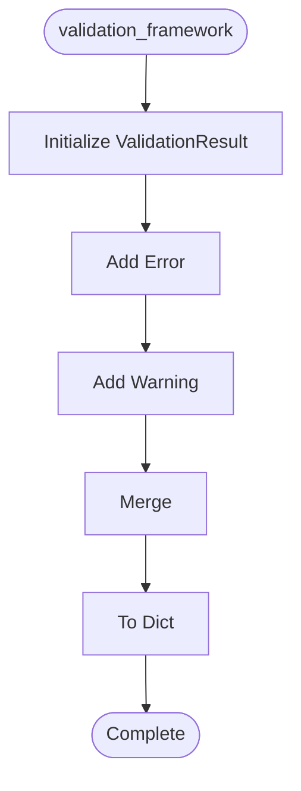

# Validation Framework

**Author:** Asif Hussain | **Copyright:** © 2024-2025 Asif Hussain. All rights reserved.

---

## Overview

Shared Validation Framework for CORTEX Orchestrators

Eliminates validation logic duplication across orchestrators.
Provides type-safe, composable, testable validation infrastructure.

Version: 1.0.0
Author: Asif Hussain

## Workflow

## Class: ValidationResult

Standard validation result.

### Methods

#### `add_error(self, message)`

Add validation error.

#### `add_warning(self, message)`

Add validation warning.

#### `merge(self, other)`

Merge another validation result.

#### `to_dict(self)`

Serialize to dictionary.

## Class: IValidator

Base validator protocol.

**Inherits from:** Protocol

### Methods

#### `validate(self, target)`

Validate target object.

Args:
    target: Object to validate
    
Returns:
    ValidationResult with errors/warnings

## Class: PlanMetadataValidator

Validates plan metadata (title, description, etc.).

### Methods

#### `validate(self, plan_data)`

Validate plan metadata.

## Class: PlanPhaseValidator

Validates plan phase structure.

### Methods

#### `validate(self, plan_data)`

Validate plan phases.

## Class: PlanDoRDoDValidator

Validates Definition of Ready and Definition of Done.

### Methods

#### `validate(self, plan_data)`

Validate DoR/DoD.

## Class: CompositePlanValidator

Composite validator for complete plan validation.

### Methods

#### `__init__(self)`

#### `validate(self, plan_data)`

Run all plan validators.

## Class: TaskImplementationValidator

Validates task implementation requirements.

### Methods

#### `validate(self, task)`

Validate task implementation.

## Class: TDDPhaseValidator

Validates TDD phase transitions.

### Methods

#### `validate(self, current_phase, target_phase)`

Validate TDD phase transition.

## Class: TDDTestValidator

Validates TDD test requirements.

### Methods

#### `validate(self, test_files, implementation_files)`

Validate TDD test coverage.

## Class: ConfigurationValidator

Validates configuration management.

### Methods

#### `validate(self, code_content)`

Validate configuration usage.

## Class: TransactionValidator

Validates transaction usage.

### Methods

#### `validate(self, code_content)`

Validate transaction usage.

## Class: CompositeValidator

Runs multiple validators and aggregates results.

### Methods

#### `__init__(self, validators)`

#### `validate(self, target)`

Run all validators.

## Functions

### `validate_plan(plan_data)`

Convenience function for plan validation.

Args:
    plan_data: Plan dictionary
    
Returns:
    ValidationResult

### `validate_task(task)`

Convenience function for task validation.

Args:
    task: Task dictionary
    
Returns:
    ValidationResult

### `validate_tdd_transition(current_phase, target_phase)`

Convenience function for TDD phase validation.

Args:
    current_phase: Current TDD phase
    target_phase: Target TDD phase
    
Returns:
    ValidationResult

### `validate_code_quality(code_content)`

Convenience function for code quality validation.

Args:
    code_content: Source code content
    
Returns:
    ValidationResult with config/transaction warnings

---

**Source:** `src/orchestrators/validation_framework.py`
