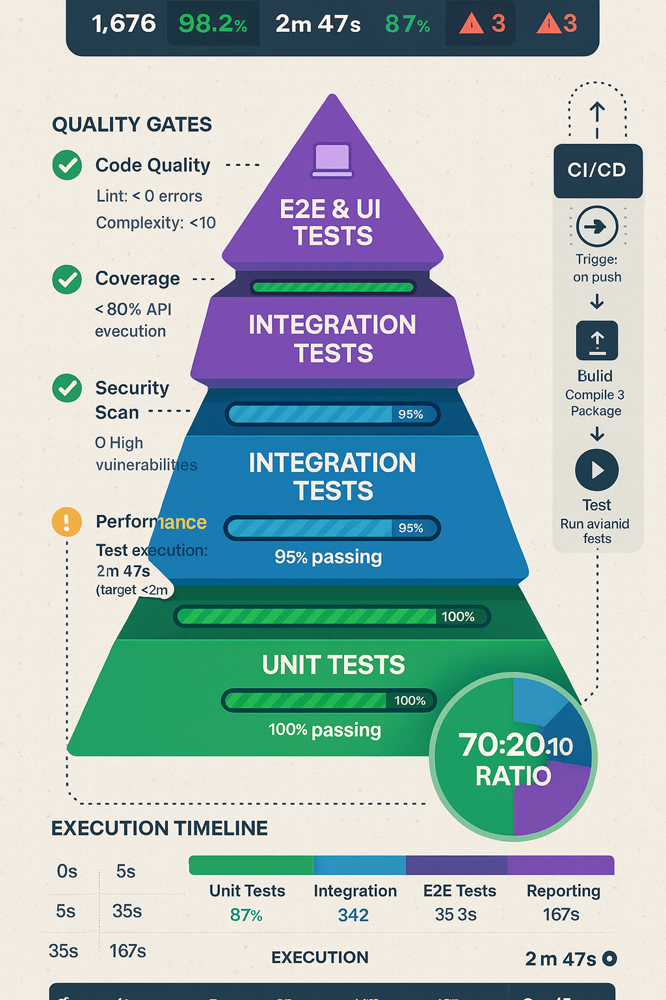

# 🎯 Planning & Strategic Diagrams

Visual representations of CORTEX's planning, security, and strategic systems.

---

## Brain Protection System (SKULL)

Seven-layer defense system protecting CORTEX integrity with semantic validation.

<figure>
  
  <figcaption><strong>SKULL Protection:</strong> Seven-layer semantic validation preventing harmful mutations 
  <strong>Layer 0:</strong> Syntax validation | <strong>Layer 1:</strong> Semantic analysis | <strong>Layer 2:</strong> Intent classification 
  <strong>Layer 3:</strong> Impact assessment | <strong>Layer 4:</strong> Mutation detection | <strong>Layer 5:</strong> Context preservation 
  <strong>Layer 6:</strong> Namespace protection | <strong>Layer 7:</strong> Integrity enforcement</figcaption>
</figure>

**Protection Layers:**
- 🛡️ **Layer 0 (Syntax)**: YAML/JSON validation, file format checks
- 🧠 **Layer 1 (Semantic)**: Operation intent analysis, prompt injection detection
- 🎯 **Layer 2 (Intent)**: Classification of modifications (safe/risky/harmful)
- 📊 **Layer 3 (Impact)**: Blast radius analysis, dependency tracking
- 🔍 **Layer 4 (Mutation)**: Detect unauthorized changes to core files
- 💾 **Layer 5 (Context)**: Preserve conversation history, pattern integrity
- 🔒 **Layer 6 (Namespace)**: Isolate workspace patterns from CORTEX patterns
- ✅ **Layer 7 (Integrity)**: Final validation before applying changes

**Related Documentation:**
- [CAPABILITIES-MATRIX.md](coming-soon.md) - SKULL capabilities
- [HELP-SYSTEM.md](coming-soon.md) - Brain protection commands

---

## Interactive Feature Planning

Vision-enabled planning workflow with DoR/DoD validation and phase breakdown.

<figure>
  
  <figcaption><strong>Planning Initiation:</strong> User says "plan [feature]" → Creates dedicated planning file 
  <strong>DoR Validation:</strong> Interactive Q&A ensuring requirements complete before development 
  <strong>Phase Breakdown:</strong> Foundation → Core → Validation with acceptance criteria 
  <strong>Vision Integration:</strong> Screenshot analysis extracts UI elements, errors, ADO fields</figcaption>
</figure>

**Planning Workflow:**
- 📋 **Initiation**: `plan [feature]` creates file in `cortex-brain/documents/planning/features/`
- 📸 **Vision Analysis** (optional): Attach screenshot → Extract requirements automatically
- ❓ **Interactive Q&A**: CORTEX asks clarifying questions, updates planning file
- ✅ **DoR Validation**: Ensure Definition of Ready complete (requirements, dependencies, design)
- 📊 **Phase Breakdown**: Foundation (structure) → Core (implementation) → Validation (testing)
- 🎯 **Acceptance Criteria**: Measurable, testable success conditions
- 🔒 **DoD Checklist**: Definition of Done (code review, tests, docs, security)
- 📁 **File-Based**: Planning artifacts persist in git-tracked files (not chat-only)

**Related Documentation:**
- [HELP-SYSTEM.md](coming-soon.md) - Planning commands
- [FEATURES.md](coming-soon.md) - Planning capabilities

---

## Pragmatic Testing Strategy

Three-tier test categorization with Phase 0 optimization patterns.

<figure>
  
  <figcaption><strong>BLOCKING:</strong> Tests that MUST pass (SKULL, integration, security) - Fix immediately 
  <strong>WARNING:</strong> Future optimization tests (performance, UI) - Skip with reason 
  <strong>PRAGMATIC:</strong> Reality-based thresholds (file size, load time) - Adjust expectations</figcaption>
</figure>

**Test Categories:**
- 🔴 **BLOCKING**: Security, integration, SKULL violations → Fix immediately, never skip
- 🟡 **WARNING**: Performance optimization, future features → Skip with pytest.skip(), track in backlog
- 🟢 **PRAGMATIC**: Threshold adjustments to match MVP reality → Update expectations, not code

**Optimization Patterns:**
- 📊 **Performance Budgets**: File-specific size limits (10KB-200KB based on purpose)
- ⏱️ **Load Time Tiers**: Simple (100ms), Moderate (150ms), Complex (200ms), Very Complex (500ms)
- 🔄 **Incremental Remediation**: Fix tests in phases by category (integration → template → YAML → metrics)
- ♻️ **Backward Compatibility**: Add aliases when refactoring APIs (avoid breaking existing code)
- 🎯 **Reality-Based Thresholds**: Adjust to current architecture, not aspirational goals

**Related Documentation:**
- [test-strategy.yaml](coming-soon.md) - Complete strategy
- [optimization-principles.yaml](coming-soon.md) - Patterns

---

## Deployment Pipeline

CI/CD workflow with health validation, brain backup, and multi-platform deployment.

<figure>
  
  <figcaption><strong>Pre-Deployment:</strong> Test suite (100% pass rate), health checks, brain backup 
  <strong>Deployment:</strong> Multi-platform build (Windows, Mac, Linux), GitHub Pages publish 
  <strong>Post-Deployment:</strong> Smoke tests, rollback capability, status monitoring</figcaption>
</figure>

**Pipeline Stages:**
- 🧪 **Pre-Deployment**: Full test suite, health validation, brain backup
- 🏗️ **Build**: Multi-platform packaging (Windows, Mac, Linux)
- 📚 **Documentation**: MkDocs site generation, GitHub Pages publish
- 🚀 **Deployment**: GitHub release, version tagging
- ✅ **Validation**: Smoke tests, integration verification
- 🔄 **Rollback**: Automatic rollback on validation failure
- 📊 **Monitoring**: Health checks, error tracking

**Related Documentation:**
- [FEATURES.md](coming-soon.md) - Deployment capabilities
- [HELP-SYSTEM.md](coming-soon.md) - Deployment commands

---

## Navigation

- **[Home](index.md)** - Return to documentation home
- **[Architecture Diagrams](coming-soon.md)** - Core system architecture
- **[Integration Diagrams](coming-soon.md)** - Data flows and integrations
- **[Operational Diagrams](coming-soon.md)** - Workflows and processes

---

**Image Source:** Generated from DALL-E 3 prompts created by Enterprise Documentation Orchestrator  
**Diagram Metadata:** See [IMAGE-CATALOG.yaml](images/diagrams/IMAGE-CATALOG.yaml)  
**Copyright:** © 2024-2025 Asif Hussain. All rights reserved.
