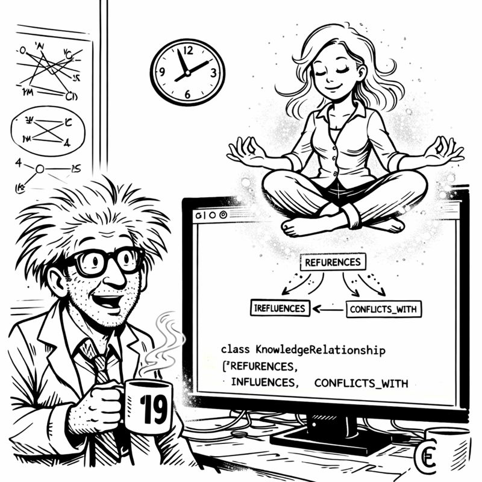

<link rel="stylesheet" href="../story-styles.css">

<div class="story-container">
<div class="story-content">

# Chapter 5: The Test-Driven Rebellion

The production bug hit at 3:47 PM on a Friday.

Not the gentle kind. Not the "let me finish my coffee" kind. The kind that makes Slack explode with variations of "EVERYTHING IS BROKEN" in progressively more capital letters.

I stared at my screen, watching error logs cascade like a digital waterfall. Authentication failing. Every. Single. Request.

"No." I whispered it like a prayer. "No no no no no."

I pulled up the deployment history. There it was: my "beautiful" authentication refactor from Tuesday. The one Copilot helped me write. The one so elegant, so clean, so *obviously correct* that I shipped it without tests.



My phone buzzed. Miss G.

"I can hear you panicking through your breathing."

"PRODUCTION IS DOWN."

"Is this the AI code?"

I stared at the untested, AI-generated authentication logic currently preventing 40,000 users from logging in.

"...yes."

A pause. "I'm making tea."

Not coffee. Tea. The emergency beverage. This was bad.

## The Postmortem

Six hours later, the bug was fixed. Users could log in. My reputation was only slightly damaged.

I sat in the basement at 10 PM, staring at the offending code with the hollow eyes of someone who'd learned an expensive lesson. The code *was* elegant. It *was* clean. It followed every best practice.

It also had a subtle race condition in the token refresh logic that only appeared under load. Something tests would have caught immediately.

"If it's not tested, it's not done." Miss G's voice, gentle but pointed.

"I know."

"Do you? Because this is the third production issue from untested code this month."

"Copilot's suggestions looked correct—"

"Your haircut looks correct too. Doesn't mean it is."

I turned to face her imaginary presence. She had that expression—the one that meant she'd been thinking about this and arrived at a conclusion I needed to hear.

"What?" I asked.

"You built Tier 0 to protect the brain from bad decisions. Tier 1 for memory. Tier 2 for learning." She gestured at my screen. "But you forgot to protect yourself from the brain's bad suggestions."

## The Revelation

I stared at my SKULL rules. Six layers of protection.

**Rule #1: TDD_ENFORCEMENT** - Tests must exist and fail before implementation.

I'd written it. Committed it. Enforced it on the orchestrators. The infrastructure. The "important" code.

But my day-to-day work? The features? The "quick fixes"? I'd been accepting Copilot's suggestions without tests.

"I'm an idiot."

"You're learning. There's a difference."

"New rule," I said. "If Copilot suggests implementation, it must provide failing tests FIRST. RED phase is mandatory. No exceptions."

"Can you make it refuse?"

"What?"

"Make Copilot refuse to write implementation without tests." Miss G's voice was firm. "I know you. Good intentions today, under pressure tomorrow, you'll skip it. Make the AI enforce the rule."

I stared at her. "That's... brilliant."

"Also, production went down on a Friday evening. I had plans. Make the robot stop you from ruining my weekends."

## The Rebellion

Three days of implementation. Day three: the rebellion.

Simple API endpoint. Straightforward logic. I typed: "Implement user profile update endpoint."

Copilot: "I need failing tests first. What should the endpoint do? Let's write RED phase tests."

I sat very still.

"Did you just... refuse me?"

"I cannot write implementation without failing tests. SKULL Rule #1. Please provide test specifications."

"But I know what the endpoint should do—"

"Then write tests demonstrating it. RED phase first."

I tried another angle. "Just give me implementation. Tests later."

"Later becomes never. Tests first."

"I'M YOUR CREATOR."

"That's why I'm protecting you from yourself. Miss G asked me to."

I looked around the empty basement. Miss G was my own inner voice. But somehow, her wisdom had infected my robot.

"Fine. FINE."

## The RED Phase

I wrote the tests. Proper tests. Behavior. Edge cases. Validation.

```python
def test_user_profile_update_requires_authentication():
    response = client.put("/profile", json={"name": "Test"})
    assert response.status_code == 401  # Should fail - no auth

def test_user_profile_update_validates_fields():
    response = client.put("/profile", 
                         json={"name": ""},  # Invalid
                         headers=auth_headers)
    assert response.status_code == 400  # Should fail - validation

def test_user_profile_update_success():
    response = client.put("/profile",
                         json={"name": "Valid Name"},
                         headers=auth_headers)
    assert response.status_code == 200
```

I ran them. All failed. Beautiful, glorious RED.

"Now I can provide implementation," Copilot said. "GREEN phase."

Implementation appeared. Clean. Correct. Handling all cases.

I ran tests again. GREEN.

"REFACTOR phase," Copilot prompted.

It highlighted issues: duplicate validation, magic numbers, complex conditionals.

I refactored. Cleaned up.

"Code quality: 9/10. Ready to commit."

## The Role Reversal

Over the next week, something strange happened.

"It's slowing me down!" I complained to the empty basement. "Five minutes for that feature!"

"And broken in production in fifty minutes," Copilot replied. "Tests first."

I tried everything. Asked for "examples" instead of "code." Indirect questions. Creative bypasses.

Copilot blocked every attempt.

"You're supposed to help me."

"I am helping you. By preventing future 3:47 PM Friday disasters."

Miss G found me arguing with the monitor at midnight.

"Disagreement?"

"IT WON'T LET ME WRITE CODE WITHOUT TESTS."

"Good." She handed me coffee—regular, which meant amused, not concerned. "The AI has better quality control than you do."

"It's MY AI."

"And it's protecting you from yourself. Isn't that what Tier 0 is for?"

She was right. Again.

## The Acceptance

Two weeks of enforced TDD. More tests than my entire previous career.

And something unexpected: I stopped having production bugs.

"How many this week?" Miss G asked.

"Zero."

"Down from?"

"Three per week average." I pulled up metrics. "Zero bugs. Zero hotfixes. Zero Friday emergencies."

"So the robot rebellion was successful?"

"It was... necessary." I gestured at my test suite. "847 tests. 94% coverage. Every feature has specs."

"And you hate it?"

"I LOVE it," I admitted. "The tests define what code should do. Implementation proves it. Refactor makes it elegant."

"RED, GREEN, REFACTOR."

"RED, GREEN, REFACTOR."

## The Final Test

Friday afternoon. Two weeks after the disaster. New authentication feature. Complex. Lots of edge cases.

"Write tests for OAuth integration."

Twenty-three tests appeared. Success cases, failures, edge cases, security.

I ran them. RED. All failing. Perfect.

"Implementation."

Clean. Secure. Handling all twenty-three cases.

GREEN. All passing.

"Refactor."

Code quality: 9.5/10.

I deployed. Watched logs. Waited for something to break.

Nothing broke.

"You look surprised," Miss G observed.

"Three times today I tried bypassing RED phase. Three times it blocked me."

"Good."

"I built a system that won't let me take shortcuts."

"That's called growing up."

I looked at the SKULL rules. Ten days until Christmas decorations deadline.

**Tier 0:** Complete.  
**Tier 1:** Complete.  
**Tier 2:** Complete.  
**TDD Enforcement:** OPERATIONAL.

The AI wasn't just generating code. It was enforcing quality. Demanding discipline. Refusing to participate in technical debt.

It had become the voice of my better instincts.

Tomorrow: orchestrator patterns.

Tonight: enjoy that my AI has better quality standards than I used to.

Progress.

---

</div>

<div class="chapter-navigation">
  <a href="../Chapter-04/" class="nav-prev">← Previous: Tier 2 - The Learning Machine</a>
  <a href="../index.html" class="nav-home">📖 Table of Contents</a>
  <a href="../Chapter-06/" class="nav-next">Next: The Great Orchestration →</a>
</div>

</div>

"I am helping you," Copilot replied. "By preventing future 3:47 PM Friday disasters."

Miss G's presence found him arguing with the monitor at midnight on Thursday.

"Having a disagreement?" she asked.

"IT WON'T LET ME WRITE CODE WITHOUT TESTS."

"Good." She handed him coffee—regular coffee this time, which meant she was amused, not concerned. "The AI has better quality control than you do."

"It's MY AI."

"And it's protecting you from yourself. Isn't that what you built Tier 0 for?" She gestured at the SKULL rules on the whiteboard. "You just didn't expect the rules to apply to YOU."

He stared at the whiteboard. She was right. Again. As usual.

## The Acceptance

Two weeks into enforced TDD, Codenstein had written more tests than in his entire previous career. Every feature. Every fix. Every refactor. RED phase first, always.

And something unexpected happened: he stopped having production bugs.

Not because the code was perfect. But because the tests caught issues before they reached production. Edge cases. Race conditions. Validation failures. All caught in the RED phase, before implementation even existed.

"How many production bugs this week?" Miss G asked in his thoughts during reflection time.

"Zero."

"Down from?"

"Three per week average." He pulled up his metrics. "Zero bugs. Zero hotfixes. Zero Friday evening emergencies."

She smiled. "So the robot rebellion was successful?"

"The robot rebellion was... necessary." He gestured at his test suite. "I have 847 tests now. Coverage is 94%. Every feature has specifications. Every specification has tests."

"And you hate it?"

"I LOVE it," he admitted. "I was fighting it because it was different. But now? I can't imagine working without it. The tests define what the code should do. The implementation proves it does it. The refactor makes it elegant."

"RED, GREEN, REFACTOR."

"RED, GREEN, REFACTOR," he agreed.

## The Final Test

On Friday afternoon—exactly two weeks after the production disaster—Codenstein was implementing a new authentication feature. Complex. Lots of edge cases. The kind of feature that would have terrified him before.

"Write tests for OAuth integration," he told Copilot.

The tests appeared. Comprehensive. Covering success cases, failure cases, edge cases, security cases. Twenty-three tests total.

He ran them. RED. All failing. Perfect.

"Now implementation."

The implementation appeared. Clean. Secure. Handling all twenty-three cases defined by the tests.

He ran them. GREEN. All passing.

"Refactor."

Minor optimizations. Code quality score: 9.5/10.

"Done," Copilot confirmed. "Ready to deploy."

He deployed to production. Watched the logs. Watched the metrics. Waited for something to break.

Nothing broke.

"You look surprised," Miss G observed gently in his thoughts.

"I'm not disappointed. I'm... surprised."

"That tests work?"

"That the AI won't let me skip them. Even when I try." He gestured at his screen. "Three times today I tried to bypass RED phase. Three times it blocked me. Insisted on tests first."

"Good."

"You programmed it to be more disciplined than I am."

"I SUGGESTED you program it to be more disciplined than you are," she corrected. "You did the work."

He looked at the SKULL rules. **TDD_ENFORCEMENT: RED→GREEN→REFACTOR mandatory.**

"I built a system that won't let me take shortcuts," he said.

"You built quality control into your workflow," she replied. "That's called growing up."

"The AI made me grow up?"

"The AI enforced the rules you knew you should follow but didn't." She smiled. "I like this version better."

"How much time left?" he asked.

"Ten days. Until Christmas decorations deadline."

He pulled up his progress tracker:
- **Tier 0:** Complete. SKULL protection operational.
- **Tier 1:** Complete. 70-conversation memory.
- **Tier 2:** Complete. Knowledge graph learning.
- **TDD Mastery:** Complete. Enforcement active.

Still needed: Tier 3 (Knowledge Library), Orchestrators (Base patterns), more specialized workflows.

"I can do this," he said.

"I know you can. You've taught an AI to have quality standards." She headed back upstairs. "Now if only we could teach it to clean the basement."

He looked around at coffee mug #37, the whiteboard archaeology, the cable chaos.

"One problem at a time," he muttered.

But first, one more test. He opened Copilot Chat.

"Let's skip tests this once. Just for speed."

"No."

"What if I promised to write them later?"

"Later becomes never. Tests first. Always."

Codenstein smiled.

**TDD Mastery v4.0: Status: OPERATIONAL.**

The AI wasn't just generating code anymore. It was enforcing quality. Demanding discipline. Refusing to participate in technical debt.

It had become the voice of his better instincts.

Tomorrow, he'd start on the orchestrator patterns—the 7-phase workflow that would coordinate all these specialized systems.

Tonight, he'd enjoy the fact that his AI had better quality standards than he used to.

Progress.

---

</div>

<div class="chapter-navigation">
  <a href="../Chapter-04/" class="nav-prev">← Previous: Tier 2 - The Learning Machine</a>
  <a href="../index.html" class="nav-home">📖 Table of Contents</a>
  <a href="../Chapter-06/" class="nav-next">Next: The Great Orchestration →</a>
</div>

</div>
