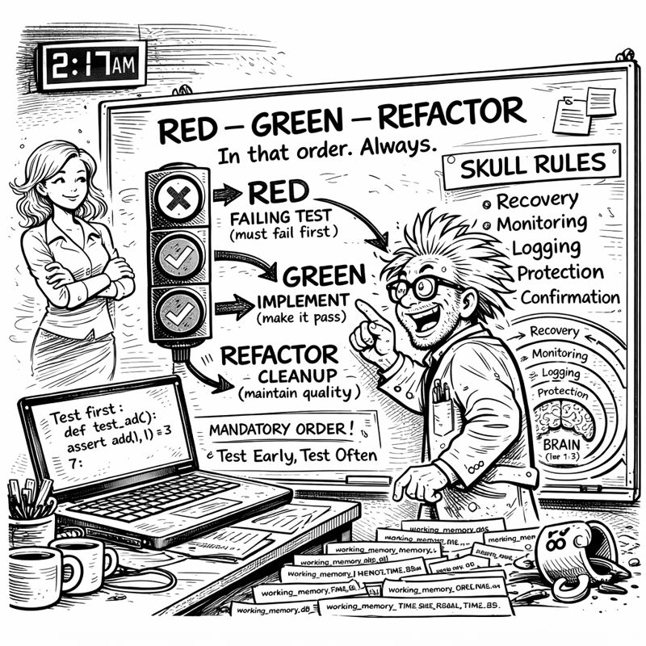
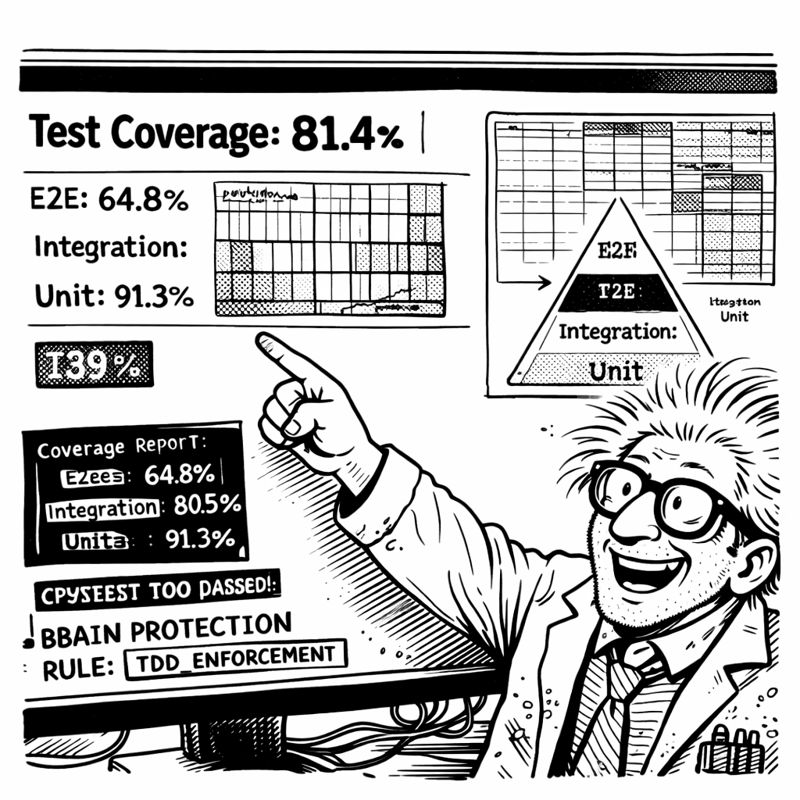

<link rel="stylesheet" href="../story-styles.css">

<div class="story-container">
<div class="story-content">

# Chapter 7: The Planning Revolution

*In which I realize I've been doing the same thing manually for two months while building automation*

---

I was writing my tenth feature plan of the week when I finally snapped.

Not dramatically. No throwing things. Just a quiet, exhausted realization that I was copying the same template AGAIN when I'd spent two months building a system specifically designed to automate repetitive work.

The irony was not lost on me.

I stared at the document:

```markdown
# Feature Plan: [NAME]

## Definition of Ready (DoR)
- [ ] Requirements clear
- [ ] Acceptance criteria defined
- [ ] Dependencies identified
- [ ] Complexity assessed

## Implementation Phases
1. RED: Write failing tests
2. GREEN: Implement functionality
3. REFACTOR: Clean and optimize

## Definition of Done (DoD)
- [ ] All tests passing
- [ ] Code reviewed
- [ ] Documentation updated
```

The SAME structure. Every. Single. Time.



"There must be a better way," I muttered.

Miss G's voice echoed in my head: *"What must have a better way?"*

"PLANNING. I'm writing the same plan over and over. Same DoR checklist. Same DoD validation. Same complexity assessment."

*"So... automate it? 🤔"*

I stopped typing. "What?"

*"You've been building AUTOMATION for two months. AUTOMATE THE PLANNING."*

"But every feature is different—"

*"Is the PROCESS different? Or just the details?"*

I stared at my screen. The process was identical. Only the feature-specific details changed.

"Oh my god."

*"You're welcome. Now let me sleep. 😴"*

## The 3 AM Complexity Revelation

At 3:47 AM (my traditional time for revelations), I had the whiteboard covered:

**HIGH Complexity:** Security features, authentication, database migrations, API integrations, payment processing.

**MEDIUM Complexity:** CRUD with business logic, multi-step workflows, caching strategies.

**LOW Complexity:** Simple CRUD, UI components, configuration updates.

"It's pattern matching," I said to no one. "Keywords trigger complexity. 'auth', 'security', 'payment'—they mean HIGH automatically."

I pulled up a new file: `planning-system-2.0-manifest.yaml`

```yaml
complexity_triggers:
  HIGH:
    keywords: [auth, security, payment, migration]
    approach: incremental
    mandatory_phases: [DoR, TDD_RED, TDD_GREEN, TDD_REFACTOR, DoD]
  
  MEDIUM:
    keywords: [workflow, state, cache, business_logic]
    approach: conditional
  
  LOW:
    keywords: [crud, ui, config, static]
    approach: skeleton
```

Simple. Pattern-based. Automatable.

The orchestrator would analyze the feature request, detect complexity from keywords, select the right template, and generate everything automatically.

"I'm going to automate planning," I announced.

*"At 4 AM?"* Miss G's presence materialized with appropriate skepticism.

"Inspiration doesn't respect business hours!"

*"Neither does insanity. But go off, I guess. 🌙"*

## Teaching Miss G About DoR/DoD

Building the manifests took three days. Not because the orchestrator pattern was hard—that part was easy. The hard part was getting the templates right.

"What's DoR?" Miss G asked during one of our brainstorming sessions.

"Definition of Ready. Checklist that proves you understand the feature BEFORE coding."

*"Like planning a trip before booking flights?"*

"Exactly! You need destination, dates, budget clear BEFORE booking. Otherwise you book flights to the wrong city."

*"And you've been booking flights to the wrong city?"*

"I've been booking flights without checking if I have a PASSPORT." I gestured at my screen. "DoR ensures all prerequisites are met. Requirements clear. Dependencies identified. Complexity assessed."

*"And DoD?"*

"Definition of Done. Validation that the feature is ACTUALLY complete. Tests passing. Code reviewed. Documentation updated."

*"So... quality control gates?"*

"Exactly."

*"And now Copilot enforces them?"*

"Can't skip DoR. Can't skip DoD. Can't skip TDD. The manifest makes it MANDATORY."



*"The AI is now your responsible parent."*

"The AI is now my ACCOUNTABILITY PARTNER."

*"Same thing. 😏"*

## The First Auto-Plan

Thursday morning. Testing time.

I typed: "Plan: Add user authentication with JWT tokens"

Copilot's response appeared:

```markdown
🎭 Planning System 2.0 Engaged

Complexity Detection:
- Keywords: authentication, JWT, tokens
- Security implications: HIGH
- Approach: INCREMENTAL with full DoR/DoD gates

# Feature Plan: User Authentication with JWT

## Definition of Ready (DoR)

**Requirements:**
- [ ] Authentication flow specified
- [ ] Token expiration policy defined
- [ ] Security requirements identified

**Dependencies:**
- [ ] JWT library selected
- [ ] Token storage approach determined
- [ ] HTTPS enforcement verified

**Complexity Assessment:**
- Level: HIGH (security-critical)
- Estimated effort: 8-12 hours

## TDD Phases

### Phase 1: RED
Write failing tests for token generation, validation, refresh...

### Phase 2: GREEN  
Implement incrementally...

### Phase 3: REFACTOR
Security audit mandatory...

## Definition of Done (DoD)
- [ ] All tests passing (100% coverage)
- [ ] Security review completed
- [ ] SKULL rules validated

✅ Plan ready. DoR must be completed before implementation.
```

I stared at the screen.

"It auto-detected HIGH complexity," I whispered.

*"What?"* Miss G's attention snapped into focus.

"IT AUTO-DETECTED. I just said 'authentication' and it KNEW. Security-critical. Incremental approach. TDD mandatory. All AUTOMATIC."

*"Is this good or are you panicking?"*

"THIS IS REVOLUTIONARY!"

## Testing the Detection

I had to make sure it wasn't a fluke.

"Plan: Add user profile page"

```
Complexity Level: LOW
Approach: SKELETON
Minimal gates, basic tests
```

"Plan: Implement payment processing with Stripe"

```
Complexity Level: HIGH
Security-critical, full DoR/DoD, TDD mandatory
```

"Plan: Add caching layer for API responses"

```
Complexity Level: MEDIUM
Business logic considerations, suggested TDD
```

Every. Single. One. CORRECT.

"It's planning better than I plan," I said.

*"Show me everything,"* Miss G demanded.

I walked her through the authentication plan. The complexity detection. The comprehensive DoR. The TDD integration. The thorough DoD.

*"This is more thorough than your wedding planning,"* she observed.

"We didn't really plan our wedding."

*"I know. That's my point. 💒"*

"The AI learned from my mistakes."

*"The AI is more organized than you've EVER been."*

"The AI enforces the discipline I SHOULD have had all along."

## The Fifteen-Minute Investment

Friday afternoon. Simple API endpoint needed. Basic CRUD. Would normally take 30 minutes.

Instead, I asked: "Plan: Add endpoint to update user profile information"

Complexity: LOW. Skeleton approach.

But the plan still included:
- Basic DoR (requirements clear, schema confirmed)
- Test requirements (validation, success cases, error handling)
- Basic DoD (tests passing, endpoint documented)

I followed it. Tests first (RED). Endpoint (GREEN). Cleanup (REFACTOR). DoD validation.

Total time: 45 minutes instead of 30.

But: 100% test coverage. Full documentation. Zero edge cases missed.

*"Worth fifteen extra minutes?"* Miss G asked.

"Zero production bugs from planned features. Versus three per week from 'quick fixes.'"

*"So the planning revolution worked?"*

"The planning revolution ENFORCED discipline. I can't skip steps anymore. The system WON'T LET ME."

*"Good. It's the responsible adult you've always needed."*

"It's the responsible adult I've always BEEN. Just inconsistently."

*"'Inconsistently' is doing a LOT of heavy lifting there. 😂"*

Fair point.

I looked at the planning manifest. DoR gates. DoD validation. Complexity classification. TDD integration. All automatic. All enforced. All consistent.

Four days until Christmas decorations deadline. Still needed: ADO Operations, Code Sanitization, final integrations.

But now I had automated planning. The AI wouldn't let me skip steps anymore.

Even when I tried.

ESPECIALLY when I tried.

**Progress through planning.**

---

</div>

<div class="chapter-navigation">
  <a href="../Chapter-06/" class="nav-prev">← Previous: The Great Orchestration</a>
  <a href="../index.html" class="nav-home">📖 Table of Contents</a>
  <a href="../Chapter-08/" class="nav-next">Next: The Enterprise Awakening →</a>
</div>

</div>
