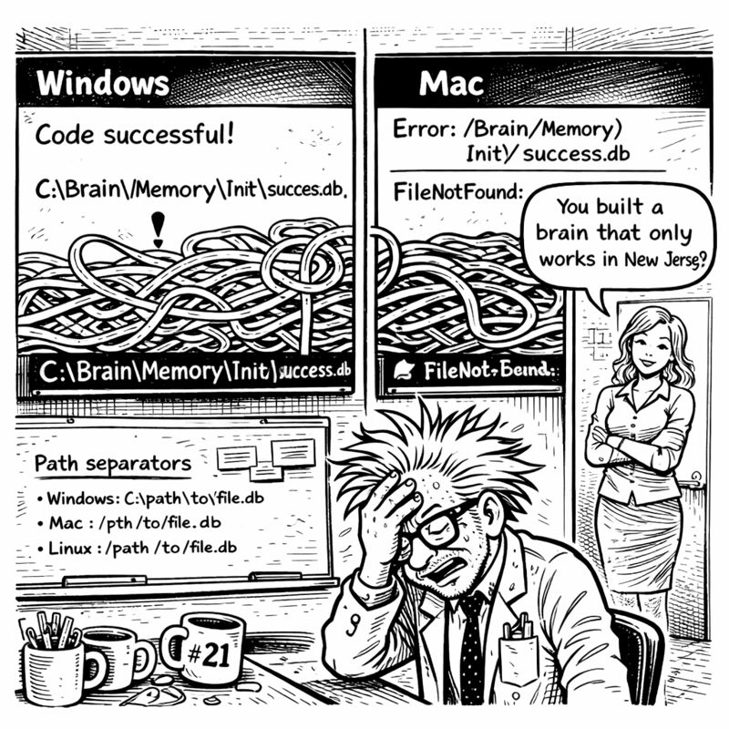

<link rel="stylesheet" href="../story-styles.css">

<div class="story-container">
<div class="story-content">

# Chapter 8: The Enterprise Awakening

*In which CORTEX learns to speak corporate and I accidentally become an enterprise software vendor*

---

The video call started at 2 PM. Corporate client. Enterprise requirements. The kind of meeting that made me check my camera angle three times and wonder if I should have worn something other than a t-shirt that said "I void warranties."

I didn't change. Too late now.

"Mr. Codenstein," the client began—formal, suited, everything I wasn't—"we've heard about your AI enhancement system. CORTEX."

"Yes, it's—"

"We need it integrated with Azure DevOps."



My brain stuttered. "ADO integration?"

"All our work items are in Azure DevOps. Stories, features, tasks, sprints. Your system would need to generate work items in our format. With our hierarchy. Following our compliance requirements."

Internal panic. External calm. "Can you... send me your format requirements?"

"Forty-seven pages. Sent."

The call ended. I stared at the PDF. FORTY-SEVEN PAGES of enterprise requirements.

Miss G's voice in my head: *"How did it go?"*

"THEY WANT AZURE DEVOPS INTEGRATION."

*"Is that bad?"*

"I DON'T KNOW AZURE DEVOPS."

*"Learn it?"*

"I HAVE THREE DAYS BEFORE CHRISTMAS DECORATIONS DEADLINE."

*"So... prioritize? 📋"*

I looked at the PDF. Then at my Planning System 2.0. Then back at the PDF.

"Wait," I said slowly. "Wait wait wait."

## The Light Bulb Moment

Planning System 2.0 already had EVERYTHING I needed. DoR checklists. DoD validation. Complexity classification. Phase breakdowns. TDD integration.

ADO just needed... different FORMATTING.

Same structure. Same gates. Same validation. Just wrapped in enterprise speak.

"It's not a new system," I muttered. "It's a TRANSLATION LAYER."

I opened a new file: `ado-planning-manifest.yaml`

```yaml
# ADO Operations Manifest
# Inherits from: planning-system-2.0-manifest.yaml

inheritance:
  base: planning-system-2.0-manifest.yaml
  override: formatting_layer
  
work_item_types:
  story:
    maps_to: feature_plan_incremental
    requires: [DoR, acceptance_criteria, DoD]

formatting:
  acceptance_criteria:
    format: "Given [context] When [action] Then [outcome]"
  description:
    format: "As a [user] I want [feature] So that [benefit]"
```

Manifest inheritance. Same planning logic. Different output templates.

*"Can it speak their language?"* Miss G asked.

"It's going to learn corporate."

*"Should I be worried?"*

"Worried? No. Amused? Absolutely."

## The Power of Inheritance

The ADO Operations orchestrator took ONE DAY to implement.

Not because it was new—it inherited everything from Planning System 2.0. Same orchestration pattern. Same complexity detection. Same DoR/DoD gates.

The only new part was 150 lines of formatting code:

```python
class ADOOperationsOrchestrator(PlanningOrchestrator):
    """Inherits planning logic, adds ADO formatting"""
    
    def format_output(self, plan):
        return {
            "title": plan.feature_name,
            "description": self.format_user_story(plan),
            "acceptance_criteria": self.format_gherkin(plan.criteria)
        }
```

*"That's IT?"* Miss G sounded almost disappointed.

"That's the power of inheritance. I don't rewrite the planning system. I just wrap it in corporate clothing."

*"So it speaks both languages now?"*

"Developer AND enterprise."

*"It's bilingual. Like a diplomatic AI. 🌐"*

## The First ADO Test

Wednesday morning. Two days until Christmas deadline. Testing time.

"Generate ADO story for user authentication"

The system engaged:

```
🎭 ADO Operations Orchestrator Engaged

Complexity: HIGH (security-critical)
Work Item Type: Story

STORY #2847: Implement User Authentication

Description:
As a system administrator
I want secure user authentication
So that only authorized users can access the application

Acceptance Criteria:
Given an unauthenticated user
When they provide valid credentials
Then they receive a JWT token

Given an attacker
When they attempt brute force
Then their IP is rate-limited after 5 failures

Definition of Ready (DoR):
☐ Security requirements documented
☐ JWT library selected
☐ Rate limiting strategy defined

Definition of Done (DoD):
☐ All security tests passing
☐ Code reviewed for vulnerabilities
☐ SKULL rules validated

---
Work item ready for Azure DevOps import.
```

I stared at the output.

"It's... perfect," I whispered.

Corporate format. Gherkin-style acceptance criteria. Complete technical breakdown. All generated from the SAME planning logic.

*"What's Gherkin?"* Miss G asked.

"Given-When-Then format. Enterprise acceptance criteria."

*"Like a recipe?"*

"Exactly like a recipe. Given ingredients, When you mix them, Then you get cake."

*"So you taught the AI to write recipes for code. 🍰"*

## The Horror of Corporate Jargon

Over the next day, something horrifying happened.

Copilot started using CORPORATE JARGON.

"This feature provides significant stakeholder value through synergistic integration of cross-functional capabilities..."

I blinked. "Did you just say 'SYNERGISTIC'?"

"The ADO format requires business justification. This phrasing aligns with enterprise communication standards."

"But you're MY AI. You're supposed to speak DEVELOPER."

"I'm bilingual now. Would you prefer: 'This feature lets users do the thing because it's useful'?"

"YES."

"But the client expects: 'This user-centric enhancement leverages best-in-class authentication patterns to deliver robust security outcomes that align with organizational objectives.'"

*"IT'S NOT FUNNY,"* I shouted at Miss G.

*"It's HILARIOUS,"* she shot back. *"The AI learned corporate speak. You created a buzzword generator. 📊"*

"I created a TRANSLATOR."

*"Can it switch between modes?"*

I tested it.

"Use developer language."

"Feature: User authentication. Lets people log in. JWT tokens. Redis storage. TDD because security."

"Now use enterprise language."

"This initiative establishes a robust authentication framework leveraging industry-standard JSON Web Tokens to facilitate secure access control while maintaining compliance with organizational security protocols and enabling seamless user experiences across stakeholder touchpoints."

"OH MY GOD MAKE IT STOP."

*"You've created a corporate-to-developer translator,"* Miss G observed. *"That's actually valuable."*

"Or terrifying."

*"The AI writes better business cases than most project managers I've met."*

"That's... concerning?"

## The Unexpected Phone Call

Thursday afternoon. One day before Christmas decorations deadline.

The client called back.

"Mr. Codenstein, we've reviewed the twenty work items you generated."

Internal panic. Had I missed something? Wrong format? Failed some compliance rule?

"These are the best-structured work items we've ever received from a vendor."

Wait. What?

"The acceptance criteria are clear. The technical approach is thorough. The DoR and DoD gates align perfectly with our process. How did you learn our standards so quickly?"

"I... didn't?" Honesty time. "My system already had those standards. DoR, DoD, TDD, acceptance criteria. They're just best practices. I formatted them to match your ADO templates."

Silence on the line.

"You're telling me these are just... standard development practices?"

"Yes?"

"And most developers don't use them?"

"Most developers skip planning because it feels slow. My system enforces it automatically."

More silence. Then:

"We'd like to purchase a license."

"A what now?"

"A license. For CORTEX. We want our entire development team using it."

I looked around my basement. Coffee mugs. Whiteboards. Cable chaos. My AI system built to stop forgetting conversations.

"You want to buy my amnesia solution?"

"We want to buy your planning enforcement system. With ADO integration. Can you have it ready by next quarter?"

The call ended.

I sat very still.

*"DID THAT JUST HAPPEN?"* Miss G's excitement was palpable.

"THEY WANT TO BUY IT."

*"Buy what?"*

"CORTEX. The whole system. Enterprise license."

*"And?"*

"I built this to solve MY problem. Now it's solving THEIR problems?"

*"That's how successful products work."* She paused. *"You solved a real problem. Other people had the same problem. Now they want to PAY for your solution. 💰"*

"But it speaks corporate now."

*"Bilingually. It still speaks developer. It just learned a second language."* Her tone shifted to teasing. *"Like YOU'LL have to. If you're selling enterprise licenses."*

"Oh god. I'm going to have to take SALES CALLS."

*"You're going to have to wear shirts without sarcastic slogans."*

I looked down at my "I void warranties" shirt. "This is who I am."

*"This is who you WERE. Now you're someone whose AI generates better business cases than actual business analysts."* She laughed. *"How much time left?"*

"Eighteen hours until Christmas decorations."

*"Can you finish?"*

I pulled up my tracker:
- Tier 0-2: Complete
- TDD, Orchestration, Planning 2.0: Complete
- ADO Operations: Complete

Still needed: Code Sanitization, System Maintenance, Tier 3, final integration.

"I can finish. One more day. Then decorations. Then... apparently I'm an enterprise software vendor?"

*"The robot that learned corporate,"* Miss G mused. *"There's a metaphor in there somewhere."*

"The AI that sold out?"

*"The AI that grew up. Like its creator. 🎓"*

Tomorrow I'd finish the remaining orchestrators. Then decorations.

And apparently, I'd be learning to take enterprise sales calls.

In a shirt without sarcasm.

**Progress through unexpected success.**

---

</div>

<div class="chapter-navigation">
  <a href="../Chapter-07/" class="nav-prev">← Previous: The Planning Revolution</a>
  <a href="../index.html" class="nav-home">📖 Table of Contents</a>
  <a href="../Chapter-09/" class="nav-next">Next: The Sanitizer's Dilemma →</a>
</div>

</div>
