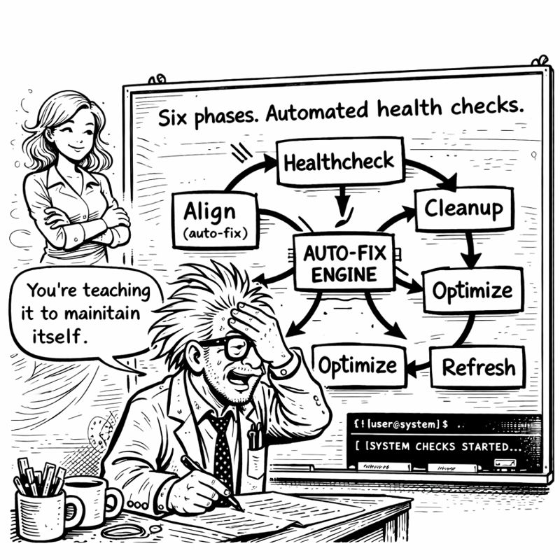
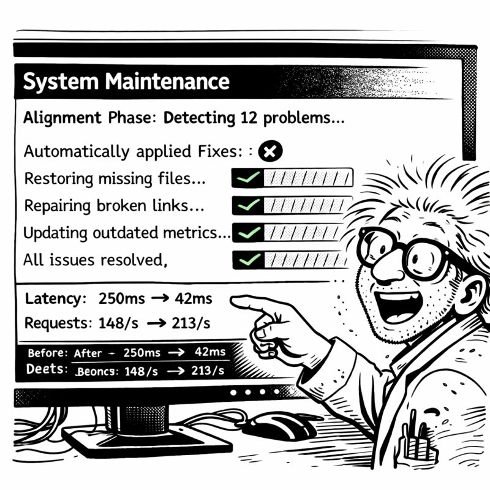

<link rel="stylesheet" href="../story-styles.css">

<div class="story-container">
<div class="story-content">

# Chapter 9: The Sanitizer's Dilemma

*In which I discover my code is a legal liability and build a solution at 2 AM*

---

Thursday evening. Eighteen hours until Christmas decorations deadline.

Miss G video called. "Show me."

"Show you what?"

"Your work. This CORTEX system. The AI brain. The orchestrators." She adjusted her reading glasses. "I've been hearing about it for two months. I'd like to see it."

Internal panic.

Not because it didn't work—it worked BEAUTIFULLY. But because the codebase was full of... evidence.

Client names. Project names. Company-specific domain logic. That one embarrassing authentication module that still had `CorpXYZ_OAuth_Handler` hardcoded in it.



"I... can't show you the code directly."

*"Why not?"*

"NDA violations. Client confidentiality. The code has REAL COMPANY NAMES in it."

She studied me through the screen. *"So your brilliant AI system is locked in a cage of your own making?"*

"...yes?"

*"That's ironic. 🔒"*

## The Challenge

I stared at my codebase. 15,000 lines of Python. Comments. String literals. Configuration files. Test fixtures.

How do you remove ALL the sensitive information without breaking EVERYTHING?

Find-and-replace? Too risky. Miss one reference and you leak client data. Replace too broadly and you break imports.

Manual review? Too slow. My eyes were already crossing from two months of continuous development.

"There has to be a systematic approach," I muttered.

*"Like everything else you've built?"* Miss G asked.

"Like... everything else..."

## The Five-Phase Approach

I started sketching on my whiteboard:

**Phase 1: Analyze** - Parse codebase as AST, identify all literals, map dependencies

**Phase 2: Mapping** - User provides replacements, system validates no conflicts

**Phase 3: Transform** - AST-based modifications (not text replacement), atomic updates

**Phase 4: Validate** - Run full test suite, verify behavior unchanged

**Phase 5: Report** - List changes, generate sanitization manifest

*"AST-based?"* Miss G asked.

"Abstract Syntax Tree. Parse code as STRUCTURE, not text. That way we're smart about what to change."

*"And this prevents breaking things?"*

"It prevents ACCIDENTALLY breaking things. Can't accidentally change language keywords. Can't break import paths."

*"When can you implement this?"*

I checked the clock. "Four hours in theory. Six if TDD catches problems."

*"You have eighteen hours. Implement it. 🛠️"*

## The Implementation

The Code Sanitization Orchestrator followed my now-familiar pattern. Seven phases. AST manipulation for safe transformation.

```python
class CodeSanitizationOrchestrator(BaseOrchestrator):
    def phase_2_analyze(self):
        """Parse codebase, identify sensitive strings"""
        for file_path in self.discover_python_files():
            tree = ast.parse(file_path.read_text())
            for node in ast.walk(tree):
                if isinstance(node, ast.Str):
                    self.potential_sensitive.append({
                        'value': node.s,
                        'file': file_path,
                        'line': node.lineno
                    })
```

First test: my authentication module.

**Original:**
```python
# CorpXYZ OAuth Integration
class CorpXYZ_OAuth_Handler:
    def __init__(self):
        self.client_id = "corpxyz_client_123"
```

**Sanitization mapping:**
```yaml
replacements:
  "CorpXYZ": "Client"
  "corpxyz_client_123": "client_oauth_id"
```

I ran the sanitizer.



```
🧹 Code Sanitization Orchestrator Engaged

Phase 2: Analysis
- Files scanned: 47
- String literals found: 2,384
- Potentially sensitive: 156

Phase 4: Transform
- Files modified: 23
- Strings replaced: 89

Phase 5: Validation
Running test suite...
```

My heart rate accelerated. Would the tests pass?

```
pytest tests/
====================================
427 passed in 12.43s
====================================

✓ All tests passing
✓ Coverage maintained: 94.7%
✓ Code behavior: PRESERVED
```

I sat back.

"It... worked?"

*"Did you doubt it would?"*

"I DOUBTED EVERYTHING."

*"Check the code. Verify it's generic now."*

I opened the OAuth module. Clean. Generic. No company names.

"I can SHOW you this now," I said quietly.

*"Then show me. 👀"*

## The Demo

I started screen sharing properly. Walking Miss G through everything.

Tier 0: Brain protection rules. TDD enforcement.

Tier 1: Conversation memory. The 70-conversation buffer that started this journey.

Tier 2: Knowledge graph. Entity relationships.

The orchestrators: Base pattern. Eight specialized implementations.

*"This is sophisticated,"* Miss G said after twenty minutes.

"It's solving MY problems. Amnesia. Inconsistent quality. Planning fatigue."

*"It's solving UNIVERSAL problems. Which is why that client wants to buy it."* She paused. *"You couldn't have shown me this six hours ago."*

"No. It was locked up."

*"And now?"*

"Now it's generic. Publishable. Shareable. And it STILL WORKS."

*"That's the power of proper sanitization. Not just removing secrets—doing it SAFELY."*

## The Unexpected Improvement

As I reviewed the sanitized code, something became apparent.

The code was... BETTER.

Generic variable names forced clearer documentation. Without company-specific terminology, I had to explain concepts more fundamentally.

**BEFORE:**
```python
def process_corpxyz_auth(corpxyz_token):
    """Process the CorpXYZ auth token"""
    return validate_token(corpxyz_token)
```

**AFTER:**
```python
def process_oauth_token(oauth_token: str) -> TokenValidation:
    """
    Validate OAuth token and extract claims
    
    Args:
        oauth_token: JWT token from identity provider
        
    Returns:
        TokenValidation with user claims and expiry
    """
    return validate_token(oauth_token)
```

Type hints added. Docstring expanded. No assumed knowledge.

"Sanitization forced documentation," I said.

*"Because you couldn't rely on implied context anymore."* Miss G smiled. *"The constraints IMPROVED the quality."*

"Like TDD. The constraint of writing tests first makes you design better APIs."

*"Exactly like TDD. 🎯"*

## The Skeleton in the Closet

As I reviewed configuration files, I found something horrifying.

```yaml
# config/legacy_credentials.yaml
database:
  password: admin123
  # TODO: Update before production deployment
```

That config was from 2019. SIX YEARS AGO. First week on that project. I'd meant to change it. Forgot.

"Did you find something?" Miss G asked. I'd gone very quiet.

"I found a password from 2019 that should NEVER have been committed."

*"In the code?"*

"In configuration. With a TODO I wrote. Six years ago. And FORGOT."

She started laughing. *"Your sanitizer found a security vulnerability?"*

"My sanitizer found EVIDENCE OF MY OWN INCOMPETENCE."

*"Your sanitizer found what code review should have caught. Automated enforcement strikes again."* She was grinning. *"How many other TODOs are lurking?"*

I searched: `grep -r "TODO" src/`

Forty-seven TODO comments. Most ancient. Most forgotten.

*"Your amnesia solution found evidence of past amnesia,"* Miss G observed.

"Recursive self-awareness. The AI would be proud."

*"The AI IS proud. And slightly judgmental. 😏"*

## The Deadline Looms

I checked the time. 11 PM. Seven hours until Christmas decorations deadline.

Still needed: System Maintenance orchestrator. Tier 3 knowledge library. Final integration.

But NOW I could share my work. Show the code. Publish it.

*"Worth the six hours?"* Miss G asked.

"Worth MORE than that. The code is BETTER now."

*"And shareable."*

"And shareable." I pulled up my task list. "Three more orchestrators. Seven hours. Can I make it?"

*"You've made every deadline so far. Well. Except Christmas decorations. Multiple times."*

"THIS TIME WILL BE DIFFERENT."

*"That's what you said LAST time."*

"Last time I didn't have autonomous maintenance."

*"You don't have it NOW. You still need to BUILD it."*

I looked at my sanitized, publishable, documentation-enriched codebase. At the orchestration pattern that had reduced 7,400 lines to 2,100.

"I can build it," I said. "I have all the patterns now."

*"Then build it. I'll see you in six hours."*

"With Christmas decorations?"

*"With EXPECTATIONS. 🎄"*

The call ended.

I cracked my knuckles. Opened a new file: `maintenance_orchestrator_v3.py`

Three orchestrators. Seven hours. One final deadline.

The sanitized code waited. Ready to become something more.

**Progress through constraints.**

---

</div>

<div class="chapter-navigation">
  <a href="../Chapter-08/" class="nav-prev">← Previous: The Enterprise Awakening</a>
  <a href="../index.html" class="nav-home">📖 Table of Contents</a>
  <a href="../Chapter-10/" class="nav-next">Next: The Self-Healing System →</a>
</div>

</div>
