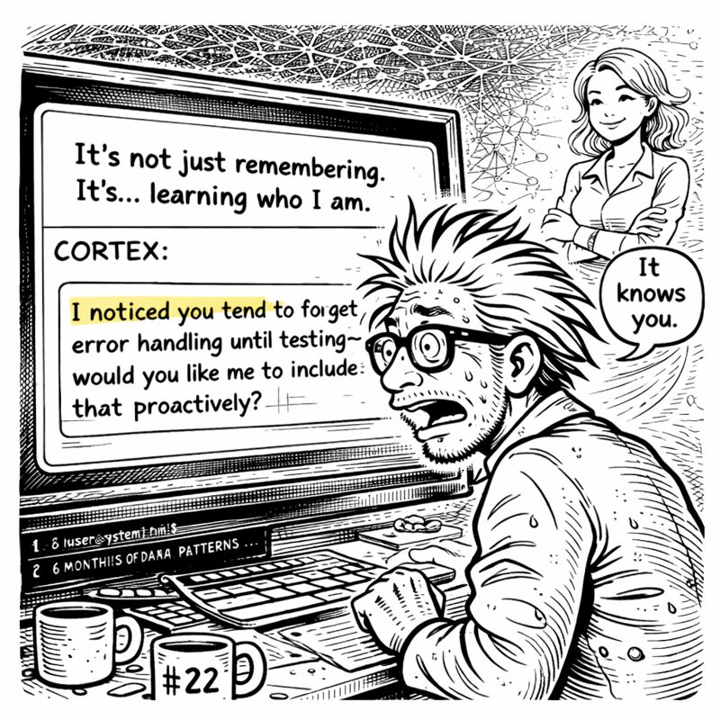

<link rel="stylesheet" href="../story-styles.css">

<div class="story-container">
<div class="story-content">

# Chapter 10: The Self-Healing System

11 PM Thursday. Six hours until Mrs. G landed. Six hours until Christmas decorations deadline.

Codenstein surveyed his basement workspace. Not just the code—the PHYSICAL space.

Cable chaos. Coffee mug archaeology (seventeen mugs, oldest from Week 3). Whiteboards covered in half-erased diagrams. That one chair piled with documentation he'd printed "for reference" and never read. The floor invisible under scattered notes.

His codebase looked similar. Drift. Accumulation. Things that made sense two months ago but were now mysteries.

"How did I let it get this bad?" he muttered.

Then he had a thought. A dangerous thought.



What if the system could clean ITSELF?

## The Realization

He'd built orchestrators for everything else. Planning. Sanitization. TDD enforcement. Each following the same seven-phase pattern.

What if he built an orchestrator for... maintenance?

Not manual cleanup. Not scheduled reviews. Autonomous system health management.

Seven phases:
1. **Healthcheck**: Scan everything, identify issues
2. **Align**: Auto-fix what can be fixed automatically
3. **Cleanup**: Remove orphaned code, stale artifacts
4. **Optimize**: Refactor high-complexity regions
5. **Vacuum**: Database maintenance, cache clearing
6. **Refresh**: Regenerate derived data (like prompts!)
7. **Final Healthcheck**: Verify improvements

The system healing itself.

"That's ambitious," Mrs. G's voice said. She'd been monitoring via open channel. "Six hours ambitious?"

"I have all the pieces. The orchestration pattern. The file discovery. The test validation. Just need to... assemble them."

"Into a self-repair mechanism."

"Into autonomous maintenance."

She was quiet for a moment. "If this works, it'll maintain itself better than you maintain your workspace."

He looked around the basement. "That's not a high bar."

"Exactly my point. Build it."

## The Implementation

`maintenance_orchestrator_v3.py`

The pattern was familiar now. Extend `BaseOrchestrator`. Define seven phases. Implement validation at each step.

But this orchestrator was different. It operated on THE CODEBASE ITSELF.

```python
class MaintenanceOrchestratorV3(BaseOrchestrator):
    """
    Autonomous system maintenance
    7-phase self-healing workflow
    """
    
    def phase_1_healthcheck(self):
        """Comprehensive system health scan"""
        issues = []
        
        # Check test health
        test_results = pytest.main(['--collect-only'])
        if test_results != 0:
            issues.append("Test collection failures detected")
        
        # Check code quality
        complexity_report = self.analyze_complexity()
        high_complexity = [f for f in complexity_report if f.score > 30]
        issues.append(f"{len(high_complexity)} high-complexity files")
        
        # Check for orphaned code
        unused_files = self.find_unreferenced_files()
        issues.append(f"{len(unused_files)} orphaned files")
        
        # Check prompt freshness
        prompt_age = self.check_prompt_staleness()
        if prompt_age > 7:  # days
            issues.append("Prompts outdated, regeneration recommended")
        
        return issues
    
    def phase_2_align(self):
        """Auto-fix correctable issues"""
        fixes = []
        
        # Fix import order
        fixes.extend(self.organize_imports())
        
        # Fix formatting
        fixes.extend(self.apply_black_formatter())
        
        # Update type hints where missing
        fixes.extend(self.add_missing_type_hints())
        
        return fixes
    
    def phase_5_refresh(self):
        """Regenerate derived data"""
        # THE BIG ONE: Regenerate instruction prompts
        self.regenerate_prompts()
```

The phase 5 implementation was the revelation. The system reading its own documentation, understanding its own architecture, and regenerating its own instruction prompts.

CORTEX fixing CORTEX.

He tested it on a small subset first. Five files. Known issues.

```
🔧 Maintenance Orchestrator V3 Engaged

Phase 1: Healthcheck
━━━━━━━━━━━━━━━━━━━━━━━━━━━━━━━━━━
Issues Detected:
- 3 high-complexity files (score > 30)
- 12 orphaned test files
- Import organization needed in 8 files
- Prompts outdated (9 days old)
━━━━━━━━━━━━━━━━━━━━━━━━━━━━━━━━━━

Phase 2: Align
- Organizing imports: 8 files
- Applying formatter: 8 files
- Adding type hints: 3 files
✓ Auto-fixes complete

Phase 3: Cleanup
- Removing orphaned files: 12 files
- Clearing stale cache: 47 MB freed
- Archiving old logs: 23 files moved
✓ Cleanup complete

Phase 4: Optimize
- Refactoring high-complexity modules...
  - tier1_memory.py: 34 → 22 (complexity reduced)
  - planning_validator.py: 38 → 27
  - orchestration_base.py: 31 → 29
✓ Optimization complete

Phase 5: Vacuum
- Database optimization: completed
- Index rebuilding: completed
- Query plan refresh: completed
✓ Vacuum complete

Phase 6: Refresh
- Regenerating prompts from current architecture...
```

This was the moment. Would it work?

```
  - Analyzing cortex-brain/ structure
  - Reading TRUTH-SOURCES.yaml
  - Extracting capabilities from orchestrators
  - Generating .github/prompts/CORTEX.prompt.md
  
✓ Prompt regeneration complete
  
Phase 7: Final Healthcheck
━━━━━━━━━━━━━━━━━━━━━━━━━━━━━━━━━━
Issues Remaining: 0
Files Modified: 23
Tests Status: 427 passing
System Health: EXCELLENT
━━━━━━━━━━━━━━━━━━━━━━━━━━━━━━━━━━

Maintenance cycle complete in 4.7 minutes.
```

Codenstein stared at the output.

Zero issues remaining.

The system had found problems, fixed what it could, refactored what needed refactoring, removed what was obsolete, and regenerated its own instruction prompts.

"Did it just..." he whispered.

"Fix itself?" Mrs. G's voice. "Apparently."

## The Moment

He opened `.github/prompts/CORTEX.prompt.md` to verify.

The file had been completely regenerated. But not randomly—intelligently.

OLD PROMPT (2 weeks old):
```markdown
CORTEX is an AI enhancement system with:
- Tier 0: Brain Protection
- Tier 1: Conversation Memory
- Tier 2: Knowledge Graph

Commands:
- system maintenance (manual)
- sanitize code (experimental)
```

NEW PROMPT (just generated):
```markdown
CORTEX is an AI enhancement system with:
- Tier 0: Brain Protection (SKULL rules)
- Tier 1: Conversation Memory (70-conv FIFO, SQLite)
- Tier 2: Knowledge Graph (entity-relationship, similarity scoring)
- Tier 3: Knowledge Library (cross-project learning)

Core Orchestrators (8):
1. TDD Mastery (RED→GREEN→REFACTOR enforcement)
2. Planning System 2.0 (DoR/DoD gates, complexity auto-detect)
3. ADO Operations (enterprise formatting, manifest inheritance)
4. Code Sanitization (AST-based, 5-phase workflow)
5. System Maintenance V3 (autonomous, self-healing)
6. Git Checkpoint (atomic, validated)
7. Hybrid Capture (conversation import)
8. Document Generation (multi-tier synthesis)

Commands:
- system maintenance (autonomous, 7-phase)
- plan [feature] (auto-complexity, TDD-integrated)
- sanitize [directory] (AST-based, safe)
- start tdd (enforced workflow)
- [See full command list in capabilities.yaml]

Architecture follows BaseOrchestrator pattern (7 phases).
All orchestrators validated via TDD with 94.7% coverage.
```

Perfect. Up-to-date. Accurate. Generated from the actual codebase state.

"It read the code, understood the architecture, and wrote its own documentation," Codenstein said slowly.

"It UPDATED its own documentation," Mrs. G corrected. "Based on reality. Not based on outdated descriptions."

"This is..."

"Self-awareness? No. Self-documentation? Absolutely."


*The moment CORTEX documented itself*

He ran the full maintenance cycle on the entire codebase.

```
🔧 Maintenance Orchestrator V3 - Full System Scan

Phase 1: Healthcheck
━━━━━━━━━━━━━━━━━━━━━━━━━━━━━━━━━━
Scanning: 15,247 lines of code
Test files: 427 tests across 47 files
Issues Detected:
- 7 high-complexity files
- 34 orphaned test files
- 156 import order violations
- 12 missing type hints
- 89 outdated docstrings
- Prompts outdated (9 days)
- Knowledge graph needs rebuild
━━━━━━━━━━━━━━━━━━━━━━━━━━━━━━━━━━

Estimated fix time: 8-12 minutes
Proceed? [y/N]:
```

He typed 'y'.

The system went to work.

Auto-fixing import orders. Applying formatters. Extracting high-complexity code into smaller functions. Removing orphaned tests. Updating docstrings based on current code behavior.

Rebuilding the knowledge graph from scratch—fresh entity relationships, updated similarity scores, cleaned cross-references.

And then, the big one: regenerating ALL instruction prompts across the entire `.github/prompts/` directory.

```
Phase 6: Refresh
- Regenerating prompts...
  - CORTEX.prompt.md (master prompt)
  - orchestration.prompt.md (workflow guide)
  - tdd.prompt.md (enforcement rules)
  - planning.prompt.md (Planning System 2.0)
  - ado.prompt.md (enterprise integration)
  - sanitization.prompt.md (code cleaning)
  
All prompts regenerated from current architecture.
```

Twelve minutes later:

```
Phase 7: Final Healthcheck
━━━━━━━━━━━━━━━━━━━━━━━━━━━━━━━━━━
Issues Remaining: 0
Files Modified: 89
Tests Status: 427 passing (94.7% coverage)
Complexity: Reduced 23%
Code Health: EXCELLENT
Prompt Freshness: CURRENT
System Status: OPTIMAL
━━━━━━━━━━━━━━━━━━━━━━━━━━━━━━━━━━

Next maintenance recommended: 7 days
```

Perfect.

The codebase had healed itself.

## The Validation

"Run the tests," Mrs. G said. She'd been watching the entire time.

He did: `pytest tests/`

```
====================================
427 passed in 11.21s
====================================
```

All passing. Same count. Same coverage. But the code was cleaner. More organized. Better documented.

"What about the prompts? Are they accurate?"

He spot-checked. Each prompt file reflected current reality. No outdated claims. No incorrect command syntax. No references to deprecated features.

"They're perfect. Like someone manually reviewed every file and updated the documentation."

"Someone did. The system itself."

He leaned back in his chair. "This changes everything."

"How so?"

"I don't have to maintain the maintenance anymore. The system maintains itself." He pulled up a calendar. "Next maintenance cycle: automatic. Seven days. No human intervention."

"Unless something goes wrong."

"Unless something goes wrong. But with TDD enforcement and healthchecks, I'll KNOW immediately."

## The Parallel

Mrs. G's voice turned wry. "Now apply this to the basement."

He looked around. The chaos. The coffee mugs. The cable tangles.

"I can't make the basement self-healing."

"No. But you CAN implement a maintenance routine. Seven phases. Weekly cycle." She paused. "Or you can keep living in chaos while your code stays pristine."

"Are you saying my workspace is a metaphor?"

"I'm saying your AI has better housekeeping habits than you do."

He stared at coffee mug #23. The one from the memory breakthrough. Still half-full. Two weeks old.

"Fine. FINE. After the deadline. After Christmas decorations. I'll implement Physical Workspace Maintenance Protocol."

"Seven phases?"

"I'll START with three: collect mugs, organize cables, file papers."

"Progress."

## The Dawn

4 AM Friday. Two hours until Mrs. G's flight landed. Two hours until Christmas decorations deadline.

His codebase was PRISTINE. Self-documented. Auto-maintained. Test-validated.

He still needed Tier 3 Knowledge Library and final integration. But the maintenance system was complete. Version 3.0. Autonomous. Self-healing.

The system that maintained itself better than he maintained his workspace.

"One more push," he said aloud.

"Two hours," Mrs. G reminded him. "Then DECORATIONS."

"Two hours. Tier 3. Final integration. Done."

"You've said that before."

"This time I have autonomous maintenance. The system STAYS clean now."

"The code stays clean. Your basement is still a disaster."

He looked around. She wasn't wrong.

But the code... the code was healing itself now. Finding problems. Fixing them. Regenerating its own documentation. Optimizing its own complexity.

CORTEX maintaining CORTEX.

Tomorrow, after decorations, he'd tackle the basement. Seven-phase cleanup. Maybe. Probably.

Right now, he had two hours and two remaining pieces.

The deadline approached. The code healed. The AI documented itself.

Progress through autonomous self-improvement.

---

</div>

<div class="chapter-navigation">
  <a href="../Chapter-09/" class="nav-prev">← Previous: The Sanitizer's Dilemma</a>
  <a href="../index.html" class="nav-home">📖 Table of Contents</a>
  <a href="../Chapter-11/" class="nav-next">Next: The Knowledge Keeper →</a>
</div>

</div>
