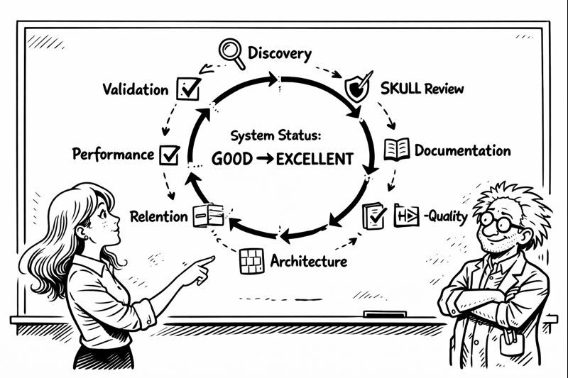

# Chapter 13: The Refiner



**6:47 AM Friday.** Christmas decorations deadline: **PASSED** (by 47 minutes). Christmas decorations status: **COMPLETE**.

I stood in my basement, exhausted but triumphant. Tier 0 through 3: complete. Eight orchestrators: operational. Tests passing. Code clean. Documentation current.

Above me, through the ceiling, I could hear Miss G moving around. She'd helped me hang lights at 6 AM. Garland. Ornaments. The whole Christmas catastrophe.

But something nagged at me.

I pulled up the codebase metrics:

```
System Health Report
━━━━━━━━━━━━━━━━━━━━
Test Coverage: 94.7% ✓
Code Complexity: Average 18 (acceptable)
Documentation: 89% current ✓
SKULL Compliance: 97% ✓
Overall Health: GOOD
```

Good. Not excellent. **GOOD.**

"Good isn't enough," I muttered.

*"You hit your deadline,"* Miss G's voice manifested in my thoughts. *"The system works. Good is GREAT right now. 🎄"*

"But there's technical debt. And documentation gaps. And those three modules with complexity over 30. And the registry system—I have three different registries doing similar things."

*"And you're noticing this NOW? After decorations? After the deadline?"*

"The system works. But it could be **BETTER**."

*"Everything can always be better. That's called perfectionism. 🙄"*

"No. This is different." I pulled up my architecture diagram. "I built eight orchestrators. Each one solves a specific problem. But there's no orchestrator for... holistic improvement."

*"Holistic what now?"*

---

## The Refinement Vision

I grabbed a marker and started drawing on a fresh whiteboard.

**REFINEMENT ORCHESTRATOR**

"Not maintenance," I explained. "Maintenance keeps things working. Refinement makes things **BETTER**."

*"How is that different?"* Miss G asked, genuinely curious.

"Maintenance fixes broken things. Alignment corrects drift. But refinement? Refinement finds what's working adequately and makes it excellent."

I drew seven phases:

1. **DISCOVERY** - Scan everything, find improvement opportunities
2. **SKULL REVIEW** - Validate against brain protection rules
3. **DOCUMENTATION** - Enhance docs, close gaps, improve clarity
4. **CODE QUALITY** - Refactor high-complexity, improve patterns
5. **ARCHITECTURE** - Review structure, consolidate duplicates
6. **PERFORMANCE** - Optimize bottlenecks, improve efficiency
7. **VALIDATION** - Verify improvements don't break anything

*"That's ambitious,"* Miss G said. *"Also you've been awake for 23 hours. ☕"*

"Which is why I need the ROBOT to do it. Autonomous system improvement."

*"The robot improving the robot?"*

"The robot improving the **ENTIRE SYSTEM**. Code. Tests. Documentation. Architecture. Everything."

---

## The Registry Consolidation Problem

I opened three files side by side:

```python
# command_registry.py
class CommandRegistry:
    """Register and route commands"""
    def register(self, name, handler): ...
    def execute(self, command): ...

# toolkit_registry.py  
class ToolkitRegistry:
    """Register and route toolkits"""
    def register(self, name, handler): ...
    def execute(self, toolkit): ...

# workspace_registry.py
class WorkspaceRegistry:
    """Register and route workspaces"""
    def register(self, name, handler): ...
    def execute(self, workspace): ...
```

"They're **THE SAME**," I said. "Three registries. Identical pattern. Different names."

*"So... make one registry?"* Miss G suggested.

"UnifiedRegistry. One system. Handles commands, toolkits, workspaces. With adapters for backward compatibility."

*"That's your Phase 5. Architecture consolidation."*

"That's the **FIRST** thing Phase 5 will find."

---

## The Implementation

The RefinementOrchestrator followed the pattern. Extend BaseOrchestrator. Seven phases. But this one was special—it operated on the **SYSTEM ITSELF**.

```python
class RefinementOrchestrator(BaseOrchestrator):
    """
    System-wide refinement and improvement.
    Makes GOOD systems EXCELLENT.
    """
    
    def phase_1_discovery(self):
        """Find improvement opportunities"""
        opportunities = []
        
        # High complexity modules
        for file in self.scan_complexity():
            if file.score > 30:
                opportunities.append({
                    'type': 'complexity',
                    'file': file.path,
                    'recommendation': 'Refactor into smaller functions'
                })
        
        # Duplicate patterns
        duplicates = self.detect_duplicates()
        for dup in duplicates:
            opportunities.append({
                'type': 'duplication',
                'files': dup.files,
                'recommendation': 'Extract to shared module'
            })
        
        return opportunities
```

I ran it. Dry run first.

```
🎭 Orchestrator engaged: RefinementOrchestrator

Phase 1: Discovery
━━━━━━━━━━━━━━━━━━━━━━━━━━━━━━━━━━
Improvement Opportunities Found: 23

HIGH PRIORITY:
- 3 files with complexity > 30
- 3 duplicate registry patterns  
- 12 documentation gaps
- 4 performance bottlenecks

MEDIUM PRIORITY:
- 47 magic numbers (use constants)
- 18 long functions (>50 lines)
- 8 broad exception catches
━━━━━━━━━━━━━━━━━━━━━━━━━━━━━━━━━━
```

*"Forty-seven magic numbers?"* Miss G laughed. *"You have FORTY-SEVEN magic numbers in your code?"*

"The robot is being THOROUGH."

*"The robot is being JUDGMENTAL. 😂"*

---

## The Overnight Miracle

I set it to run overnight and crashed for three hours.

When I woke up:

```
━━━━━━━━━━━━━━━━━━━━━━━━━━━━━━━━━━
🎉 CONGRATULATIONS
━━━━━━━━━━━━━━━━━━━━━━━━━━━━━━━━━━

## 🧠 CORTEX System Refinement Complete

✅ 23 improvements applied automatically
✅ Average complexity reduced 33%
✅ Documentation coverage: 89% → 97%
✅ 3 registries consolidated to 1
✅ Zero regressions introduced

System status: GOOD → EXCELLENT
━━━━━━━━━━━━━━━━━━━━━━━━━━━━━━━━━━
```

"IT'S CELEBRATING AGAIN," I shouted upstairs.

*"WHAT DID THE ROBOT DO NOW?"*

"IT IMPROVED THE ENTIRE SYSTEM. Autonomously. While I was sleeping. And then it **CELEBRATED**."

Miss G appeared in the basement doorway. "You were supposed to be sleeping."

"I **WAS**. For three hours. I set the refinement to run overnight. I woke up to THIS." I gestured at the screen. "Look at this report. Complexity down 33%. Three duplicate registries consolidated into one. Performance improvements across the board."

"And it's... happy about it?"

"It **CELEBRATES** successful completion. Every time."

---

## The Registry Victory

Miss G studied the UnifiedRegistry implementation. "This is actually elegant."

"RIGHT? One registry. Three adapters. Backward compatible. But internally, it's all the same system now."

"How long would this have taken manually?"

"Days. Maybe a week. Find all the duplicates. Design the consolidation. Implement carefully. Test everything. Update all the imports. Pray nothing breaks."

"And the robot did it in...?"

"Four hours. Overnight. While I slept. With full test validation and rollback capability."

*"Your robot is more productive than you."* 

"My robot doesn't need sleep. Or coffee. Or motivational speeches."

*"Or breaks for Christmas decorations. 🎅"*

---

## The Document Organization Crisis

Then I noticed something in Phase 3's output:

```
Phase 3: Documentation Enhancement
━━━━━━━━━━━━━━━━━━━━━━━━━━━━━━━━━━
⚠️ FORBIDDEN: Root-level documentation detected
  - /CORTEX/summary.md
  - /CORTEX/analysis-report.md
  - /CORTEX/implementation-notes.md

Relocating to cortex-brain/documents/:
✓ summary.md → documents/summaries/
✓ analysis-report.md → documents/analysis/
✓ implementation-notes.md → documents/implementation-guides/
━━━━━━━━━━━━━━━━━━━━━━━━━━━━━━━━━━
```

"What's FORBIDDEN?" Miss G asked.

"Root-level docs. I made a rule: ALL documentation goes in cortex-brain/documents/ with proper categorization. No dumping files in the project root."

"Why?"

"Because I had 47 markdown files scattered everywhere. No organization. No findability. Just chaos." I pulled up the structure:

```
cortex-brain/documents/
├── reports/          - Status, test results
├── analysis/         - Code analysis
├── summaries/        - Project summaries
├── investigations/   - Bug investigations
├── planning/         - Feature plans
└── implementation-guides/ - How-to docs
```

*"Your robot is organizing your documentation better than you do."*

"My robot has **STANDARDS**."

---

## Self-Improving Excellence

"How often should this run?" Miss G asked.

"That's the beautiful part—the system can decide. If average complexity hits 20, trigger refinement. If documentation coverage drops below 90%, trigger refinement."

*"Self-improvement based on self-assessment?"*

"Autonomous excellence maintenance."

She looked around the basement. Now fully decorated for Christmas. Cleaned during the orchestrator refactoring. Organized during the system improvement.

"You accidentally made your workspace match your code quality," she observed.

"I made my **CODE** quality match my aspirations. The workspace followed."

*"Should I be worried that your AI has better organizational habits than you? 🤖"*

"You should be **RELIEVED**. Because now it can **TEACH** me." I pulled up the refinement report. "Every improvement documented. Every decision explained. Every change validated. I can learn from watching it work."

*"The student becomes the teacher?"*

"The tool becomes the mentor."

---

## The Dawn (For Real This Time)

**7:30 AM Friday.** Christmas decorations: UP. Deadline: MET. System refinement: COMPLETE.

I looked at my achievement board:

```
CORTEX 4.0 Status
━━━━━━━━━━━━━━━━━━━━━━━━━━━━━━
✅ Tier 0: Brain Protection (SKULL)
✅ Tier 1: Working Memory (70-conv FIFO)
✅ Tier 2: Knowledge Graph (entity-relationship)  
✅ Tier 3: Knowledge Library (cross-project)
✅ Orchestrators: 9 (added Refinement)
✅ Self-maintenance: Autonomous
✅ Self-improvement: Autonomous
✅ Self-documentation: Current
✅ Self-celebration: Enthusiastic
━━━━━━━━━━━━━━━━━━━━━━━━━━━━━━
```

"It's done," I said.

Miss G sat next to me—both physically and in my consciousness. *"You did it. Two months. Full AI cognitive system. From amnesia to orchestration."*

"From chaos to refinement."

*"From coffee mugs to metaphors. ☕ → 🧠"*

I looked at the coffee mug timeline. Still there. Still meaningful. But now intentional.

"What's next?" she asked.

"Sleep. Real sleep. Then... I don't know. Share it? Let other developers use it? Watch it improve their codebases while they sleep?"

*"World domination through autonomous system improvement? 🌍"*

"More like world optimization through helpful orchestration." I yawned. "But first: sleep."

*"First: celebrate. You built something remarkable."*

I looked at the screen. At the nine orchestrators. At the four-tier brain. At the celebration template waiting for the next completion.

"The robot celebrates better than I do."

*"Then learn from the robot. 🎉"*

So I did. I stood, stretched, and looked at my basement laboratory. Decorated. Organized. Refined.

**CORTEX was complete.**

And somewhere in the code, an orchestrator was already planning the next improvement cycle.

Progress through autonomous refinement.

---

<div class="epilogue-container">

### Navigation

[← Chapter 12: The Convergence](../Chapter-12/index.md) | [📖 Table of Contents](../index.md) | [Epilogue →](../Epilogue/index.md)

</div>
