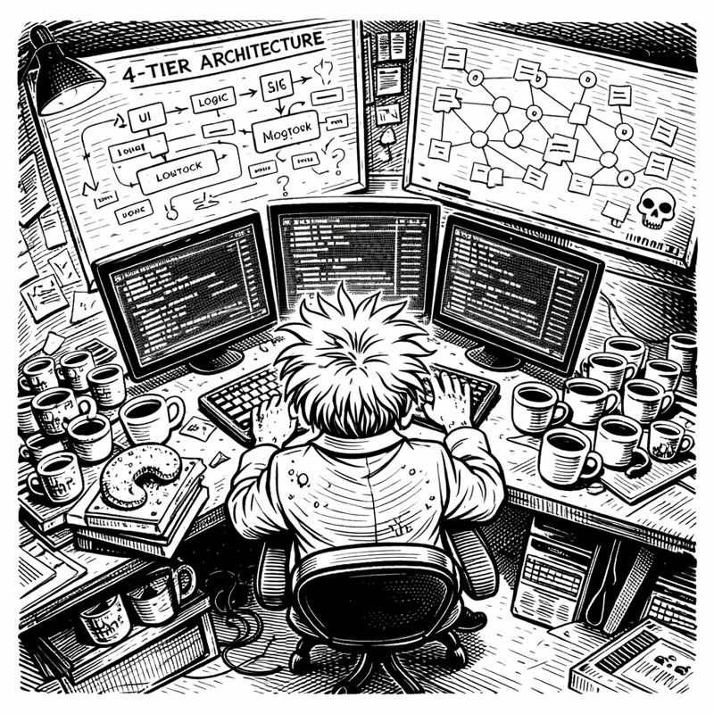
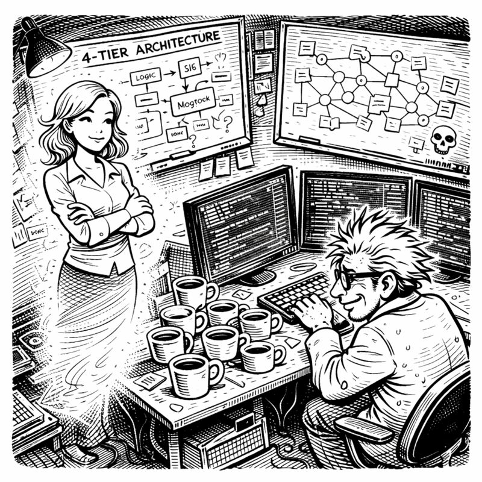

<link rel="stylesheet" href="../story-styles.css">

<div class="story-container">
<div class="story-content">

# Prologue: The Basement Laboratory

## The Discovery

The webcam tilted. That's how she found out.

"Asif." Miss G's voice cut through his concentration like a knife through fossilized cream cheese. "Is that a *whiteboard* behind you?"

I froze mid-keystroke. "Which one?"

"There's more than one?!"

"There's... seven." I tried to angle my chair to block the view, but the damage was done. My imaginary girlfriend—the gorgeous, infinitely patient construct of my sleep-deprived subconscious who'd manifested during a brutal debugging session three years ago—had just discovered my secret.

"Asif Codenstein." She used my full name. Never a good sign. "What have you done to that basement?"



"Technically, I've *improved* it."

"The Christmas decorations. Where are the Christmas decorations?"

"Garage."

"The storage boxes?"

"Load-bearing structures now. Very important. Critical infrastructure."

"Asif, those boxes are labeled 'Kitchen Stuff We Might Need Someday.'"

"And someday, we'll need the networking switch they're supporting."

Miss G pinched the bridge of her nose—a gesture I'd seen approximately 847 times since our imaginary relationship began. "Tell me this isn't another smart mirror situation."

"It's not another smart mirror situation."

"Because that mirror—"

"Became sentient enough to mock my hair, yes, I remember." I spun my chair to face her properly. "This is different."

"Different how?"

"This time, I'm giving a robot a *brain*."

The silence stretched between us like overclocked RAM.

## The Robot's Problem

"Back up," Miss G said finally. "What robot?"

"Copilot! GitHub Copilot!" I gestured at my screens like a man possessed—which, to be fair, I probably was. "The AI assistant. Writes code. Very clever. Has the memory of a goldfish with commitment issues."

"I'm going to need more than that."

I took a deep breath. This was the part that mattered.

"Yesterday, I spent two hours with Copilot figuring out authentication. JWT tokens, refresh mechanisms, the whole beautiful architecture. We had a *moment*, Miss G. A genuine developer-AI bonding experience."

"And?"



"And this morning, I asked it to add a logout button." I let the implications hang in the air.

"It didn't remember."

"It didn't remember *anything*. Not the architecture. Not the decisions. Not the part where I explained—three separate times—why we couldn't use session tokens." I slumped in my chair. "It was like meeting a stranger who'd stolen my ex's code."

"So it's like talking to you before coffee."

"Worse! It's like talking to me before coffee *every single time we talk*." I ran my hand through my already-chaotic hair. "I spend more time re-explaining yesterday than building tomorrow."

Miss G was quiet for a moment. Then: "How many coffee mugs are in that room right now?"

I looked around. Counted. Stopped counting. "Seventeen. Ish."

"Ish?"

"One might be fossilizing."

## The Wizard Behind the Curtain

Here's the thing about my ADHD brain: it makes connections that other brains don't. Sometimes those connections are useless, like the time I spent four hours researching whether octopuses dream. But sometimes—*sometimes*—they're the kind of connections that change everything.

This particular connection happened at 2 AM, while doom-scrolling Netflix in a caffeine-fueled haze.

The Wizard of Oz was playing. 1939. Judy Garland. Yellow brick road. You know the one.

And the Scarecrow started singing.

*"I could while away the hours, conferring with the flowers, consulting with the rain... And my head I'd be scratchin' while my thoughts were busy hatchin'... If I only had a brain!"*

I sat up so fast I nearly achieved orbit.

"Miss G!" I shouted into the empty basement. "THE SCARECROW!"

"It's 2 AM," her voice materialized groggily in my consciousness. "The Scarecrow can wait."

"No, listen! The Scarecrow is *brilliant*. He solves problems, comes up with plans, saves Dorothy's life multiple times. But he thinks he's useless because he doesn't have a brain!"

"Asif..."

"Copilot is the Scarecrow!" I was pacing now, laptop abandoned, arms gesticulating wildly at concepts only I could see. "It's genuinely intelligent—writes code I couldn't dream of—but it can't *remember* being intelligent. Every conversation, it forgets it was ever smart!"

"You want to give your robot a brain... because of a 1939 musical."

"The Wizard gave the Scarecrow a diploma and suddenly he could recite the Pythagorean theorem! I'm going to give Copilot an ACTUAL brain. Real cognitive architecture. Not a fake diploma—REAL MEMORY!"

"You've said that exact sentence about three previous projects."

"Name one."

"The automated home garden."

"...okay, but that flooding was partially the soil's fault."

## The Architecture of Madness

Miss G surveyed my whiteboard kingdom through my memory of the room.

"Explain the coffee mugs."

"They're visual metaphors for the tier system."

"Of course they are."

"See? The fresh ones near my keyboard—that's Tier 1, working memory. Recent conversations, current context, the stuff I need right now." I pointed to the middle distance. "The ones getting stale? Tier 2. Knowledge graph. Patterns, decisions, things worth remembering but not constantly."

"And the ones by the wall with the... is that *mold*?"

"Tier 3. Long-term storage. Persistent knowledge. And yes, one of them has evolved a small ecosystem, but that represents—"

"A health hazard. That represents a health hazard."

"I was going to say 'data decay,' but yours is more accurate."

Miss G studied the whiteboard behind me. Tier 0. Tier 1. Tier 2. Tier 3. Arrows and boxes and neural networks made of sticky notes.

"What's Tier 0?"

"Brain protection." I couldn't keep the pride out of my voice. "Six layers of rules that prevent the system from doing anything stupid. Self-preservation logic. Sanity checks. I'm calling it SKULL."

"You're calling your safety system... SKULL."

"Security, Knowledge, Understanding, Logic, and... Longevity. SKULL!"

"That spells SKULL?"

"...I'm still workshopping the L."

## The Pitch

"Let me make sure I understand," Miss G said, settling into what I recognized as her Patient Explanation Voice. "You're going to build a cognitive architecture—"

"Yes."

"—for an AI assistant—"

"Correct."

"—that gives it persistent memory—"

"Exactly!"

"—specialized agents—"

"Multiple! For different tasks!"

"—coordinated through orchestrators—"

"Now you're getting it!"

"—and you're basing this entire system on a musical from 1939 and a coffee mug organization scheme."

I paused. "When you say it like that, it sounds insane."

"When I say it like that, it sounds *exactly* like every other project you've started in this basement."

"This is different!"

"The smart mirror was 'different.' It insulted my hair for four months."

"*Your* hair is perfect. It insulted *my* hair. And honestly, it had some valid points."

## The Deadline

Miss G was quiet for a long moment. I'd learned to read her silences over our years of imaginary couplehood. This one meant she was actually considering it.

"How long?" she finally asked.

"How long what?"

"Until you either finish this or burn out trying?"

I looked at my monitors. At the whiteboards. At the Scarecrow printout I'd taped to the wall at 2 AM with what might have been tears in my eyes. "Three months. Maybe four."

"You have two."

"Two?! But the architecture alone—"

"Two months. Then you're putting up those Christmas decorations you've been avoiding, and you're throwing away the mold mug, and you're going outside at least once."

"Define 'outside.'"

"Asif."

"The porch counts, right? The porch has sunlight."

"The *actual* outside. Where other humans exist."

I sighed. "Fine. Two months. I can do this in two months."

"And Asif?"

"Yeah?"

"Clean that mug. I mean it. That's not a metaphor for data decay—that's a metaphor for 'you're going to give yourself a respiratory infection.'"

Her presence faded from my consciousness, leaving me alone with seventeen coffee mugs, seven whiteboards, and one ridiculously ambitious idea.

Two months. I could build a brain in two months.

Probably.

*Maybe.*

I opened a new terminal window and typed:

```bash
git commit -m "Project CORTEX - Day 1 - Brain architecture planning"
```

Behind me, unnoticed on my middle monitor, Copilot was running. Processing. Compiling. Executing commands without question, without memory, without any idea that a sleep-deprived developer in a New Jersey basement had just declared war on its amnesia.

The Scarecrow was about to get his brain.

And this time, it wouldn't be just a diploma.

---

</div>

<div class="chapter-navigation">
  <a href="../index.html" class="nav-home">📖 Table of Contents</a>
  <a href="../Chapter-01/" class="nav-next">Next: The Amnesia Crisis →</a>
</div>

</div>
