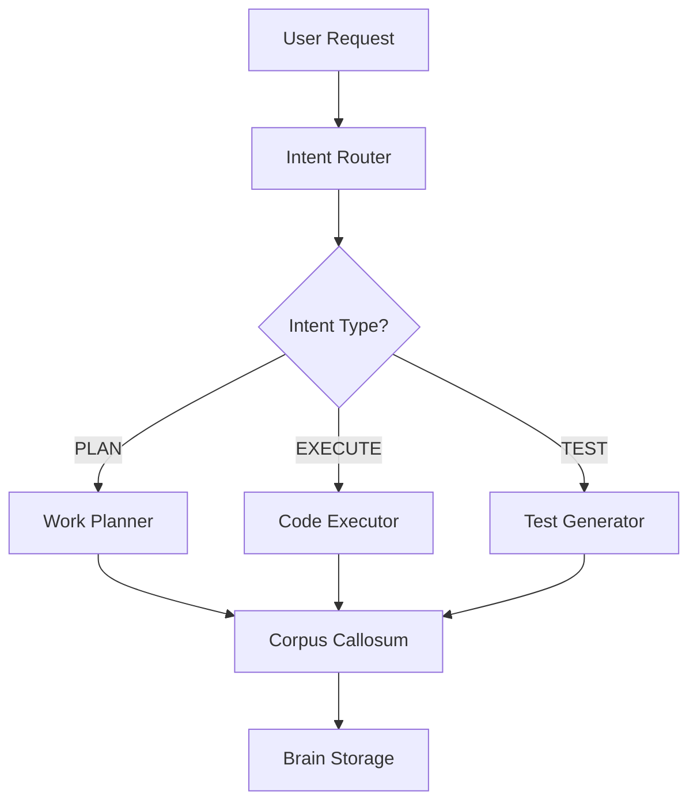

# Technical Styling Examples

This page demonstrates the new technical documentation styling for easy visual scanning.

---

## API Endpoint Example

<div class="technical-section">

### <span class="api-method get">GET</span> `/api/v1/sessions/{id}`

Retrieves a session by its unique identifier.

#### Parameters

<table class="params-table">
  <thead>
    <tr>
      <th>Name</th>
      <th>Type</th>
      <th>Required</th>
      <th>Description</th>
    </tr>
  </thead>
  <tbody>
    <tr>
      <td><code>id</code></td>
      <td><span class="param-type">string</span></td>
      <td><span class="param-required">Required</span></td>
      <td>Unique session identifier (e.g., "PQ9N5YWW")</td>
    </tr>
    <tr>
      <td><code>include_messages</code></td>
      <td><span class="param-type">boolean</span></td>
      <td><span class="param-optional">Optional</span></td>
      <td>Include conversation messages (default: false)</td>
    </tr>
  </tbody>
</table>

#### Response

```json
{
  "id": "PQ9N5YWW",
  "created_at": "2025-11-06T10:30:00Z",
  "status": "active",
  "message_count": 42
}
```

</div>

---

## Status Indicators

<span class="status-indicator status-implemented">✅ Fully Implemented</span>
<span class="status-indicator status-in-progress">🔄 In Progress</span>
<span class="status-indicator status-planned">📋 Planned</span>
<span class="status-indicator status-deprecated">⚠️ Deprecated</span>

---

## Configuration Example

<div class="config-block">
  <div><span class="config-key">site_name</span>: <span class="config-value">CORTEX Documentation</span></div>
  <div><span class="config-key">theme</span>: <span class="config-value">material</span></div>
  <div><span class="config-key">primary_color</span>: <span class="config-value">indigo</span></div>
</div>

---

## File Path Example

<div class="file-path">src/CORTEX/tier1/conversation_manager.py</div>
<div class="file-path">docs/architecture/three-tier-brain.md</div>
<div class="file-path">cortex-brain/knowledge-graph.yaml</div>

---

## Terminal Commands

<div class="terminal-block">
mkdocs serve
</div>

<div class="terminal-block">
mkdocs gh-deploy --force
</div>

<div class="terminal-block">
git add . && git commit -m "docs: Update styling" && git push
</div>

---

## Technical Callouts

<div class="tech-note">
💡 <strong>Note:</strong> All API endpoints require authentication using Bearer tokens.
</div>

<div class="tech-warning">
⚠️ <strong>Warning:</strong> This operation modifies the database directly. Use with caution in production.
</div>

<div class="tech-tip">
✨ <strong>Tip:</strong> Use the <code>--verbose</code> flag to see detailed output during debugging.
</div>

---

## Implementation Status Table

| Feature | Status | Version | Notes |
|---------|--------|---------|-------|
| Tier 1: Working Memory | <span class="status-indicator status-implemented">✅ Implemented</span> | v3.0 | SQLite conversations |
| Tier 2: Knowledge Graph | <span class="status-indicator status-implemented">✅ Implemented</span> | v3.0 | FTS5 search |
| Tier 3: Context Intelligence | <span class="status-indicator status-implemented">✅ Implemented</span> | v3.0 | Git metrics |
| Agent Architecture | <span class="status-indicator status-in-progress">🔄 In Progress</span> | v4.0 | 10 specialist agents |
| Dashboard | <span class="status-indicator status-planned">📋 Planned</span> | v4.0 | Live visualization |

---

## Multiple API Methods

<div class="technical-section">

### Session Management

<p><span class="api-method get">GET</span> <code>/api/v1/sessions</code> - List all sessions</p>
<p><span class="api-method post">POST</span> <code>/api/v1/sessions</code> - Create new session</p>
<p><span class="api-method put">PUT</span> <code>/api/v1/sessions/{id}</code> - Update session</p>
<p><span class="api-method delete">DELETE</span> <code>/api/v1/sessions/{id}</code> - Delete session</p>

</div>

---

## Version Badge Example

<span class="version-badge">v3.0.0</span>
<span class="version-badge">v4.0.0-beta</span>
<span class="version-badge">v5.0.0-alpha</span>

---

## Architecture Diagram

<div class="architecture-diagram">



</div>

---

## Clean Tables

### Performance Metrics

| Tier | Query Time | Storage | Status |
|------|------------|---------|--------|
| Tier 1 | < 50ms | SQLite | ✅ Active |
| Tier 2 | < 150ms | YAML | ✅ Active |
| Tier 3 | < 200ms | YAML | ✅ Active |

### Test Results

| Test Suite | Pass Rate | Coverage | Duration |
|------------|-----------|----------|----------|
| Unit Tests | 100% | 95% | 2.3s |
| Integration | 98% | 87% | 8.7s |
| E2E Tests | 96% | 72% | 45.2s |

---

## Standard Admonitions

!!! note "Clean Information Box"
    This is a note with light blue background - perfect for general information.

!!! tip "Helpful Tip"
    This is a tip with light green background - use for best practices.

!!! warning "Important Warning"
    This is a warning with light orange background - use for cautions.

!!! danger "Critical Alert"
    This is a danger box with light red background - use for critical warnings.

!!! example "Code Example"
    ```python
    def hello_world():
        print("Clean, readable code!")
    ```

---

## Inline Code and Highlights

Regular text with `inline code` that has a light gray background.

This is ==highlighted text== with a yellow background for emphasis.

Use **bold text** for strong emphasis and *italic text* for subtle emphasis.

---

## Professional Color Palette

The new color scheme uses:

- **Primary:** Indigo `#3f51b5` (professional, readable)
- **Secondary:** Blue `#2196f3` (clean, technical)
- **Accent:** Cyan `#00acc1` (highlights)
- **Success:** Green `#4caf50` (positive actions)
- **Warning:** Orange `#ff9800` (cautions)
- **Danger:** Red `#f44336` (critical alerts)

All backgrounds are **light and subtle** for easy reading and professional appearance.

---

This page demonstrates all the new technical styling features. Use these patterns throughout your documentation for consistent, scannable technical content.
