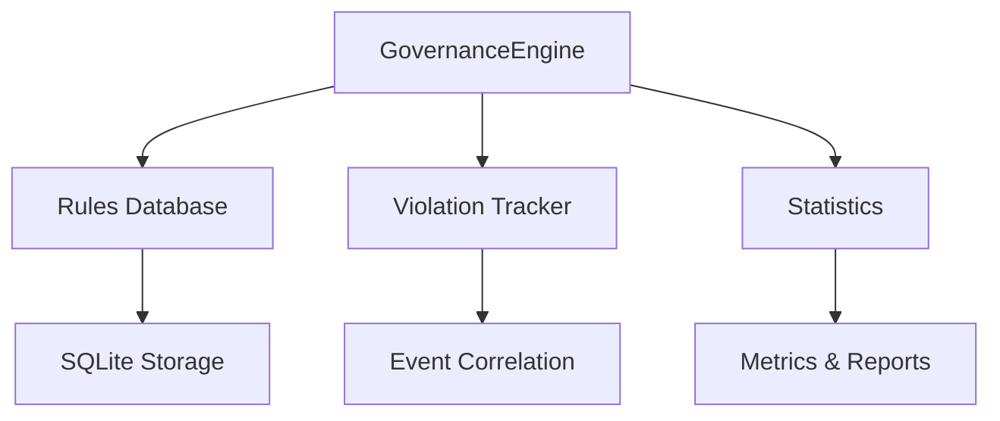

# Tier 0: Governance Engine

The foundation of CORTEX - immutable rules that guide all operations.

## Overview

Tier 0 provides governance through:

- **Immutable Rules**: Core principles that cannot be overridden
- **Violation Tracking**: Detect and log rule violations
- **Automatic Enforcement**: Pre-commit hooks enforce quality gates
- **Audit Trail**: Complete history of governance decisions

## Architecture



## Core Components

### GovernanceEngine Class

The main interface for governance operations:

```python
from tier0 import GovernanceEngine

# Initialize
with GovernanceEngine('cortex-brain.db') as engine:
    # Add a rule
    engine.add_rule({
        'rule_id': 'TDD_ENFORCEMENT',
        'rule_number': 20,
        'title': 'Test-Driven Development',
        'description': 'Write tests before code',
        'category': 'TESTING',
        'severity': 'CRITICAL',
        'immutable': True
    })
    
    # Query rules
    critical_rules = engine.get_rules_by_severity('CRITICAL')
    
    # Log violation
    violation_id = engine.log_violation(
        rule_id='TDD_ENFORCEMENT',
        context='Code written without test'
    )
    
    # Get statistics
    stats = engine.get_statistics()
```

## Rule Categories

| Category | Description | Examples |
|----------|-------------|----------|
| `ARCHITECTURE` | System design principles | SOLID, modularity |
| `DATA` | Data integrity rules | Schema validation, backups |
| `TESTING` | Testing requirements | TDD, coverage ≥95% |
| `WORKFLOW` | Development workflow | Checkpoints, commits |
| `COMMUNICATION` | Interface standards | API contracts, prompts |

## Severity Levels

| Level | Impact | Action |
|-------|--------|--------|
| `CRITICAL` | System failure | Block commit |
| `HIGH` | Major issue | Require review |
| `MEDIUM` | Quality concern | Warn developer |
| `LOW` | Minor issue | Log only |

## Database Schema

### Rules Table

```sql
CREATE TABLE rules (
    rule_id TEXT PRIMARY KEY,
    rule_number INTEGER UNIQUE NOT NULL,
    title TEXT NOT NULL,
    description TEXT NOT NULL,
    category TEXT NOT NULL,
    severity TEXT NOT NULL,
    rationale TEXT,
    examples TEXT,
    immutable BOOLEAN DEFAULT TRUE,
    deprecated BOOLEAN DEFAULT FALSE,
    created_at TIMESTAMP DEFAULT CURRENT_TIMESTAMP,
    updated_at TIMESTAMP DEFAULT CURRENT_TIMESTAMP
)
```

### Violations Table

```sql
CREATE TABLE violations (
    violation_id INTEGER PRIMARY KEY AUTOINCREMENT,
    rule_id TEXT NOT NULL,
    event_id TEXT,
    context TEXT NOT NULL,
    severity TEXT NOT NULL,
    detected_at TIMESTAMP DEFAULT CURRENT_TIMESTAMP,
    resolved BOOLEAN DEFAULT FALSE,
    resolved_at TIMESTAMP,
    resolution_notes TEXT,
    FOREIGN KEY (rule_id) REFERENCES rules(rule_id)
)
```

## Migration

Convert existing YAML/Markdown rules to SQLite:

```bash
python cortex-brain/left-hemisphere/tier0/migrate_governance.py \
  --yaml governance/tier-0/rulebook.yaml \
  --md governance/rules.md \
  --db cortex-brain.db
```

## CI/CD Integration

Tier 0 enforces rules via:

1. **Pre-commit Hook**: Tests + coverage before commit
2. **GitHub Actions**: Automated testing on push
3. **Quality Gates**: Block merges if violations exist

### Pre-commit Hook

```bash
#!/bin/bash
# Run tests with coverage
pytest tests/tier0/ \
  --cov=cortex-brain/left-hemisphere/tier0 \
  --cov-fail-under=95 \
  -v

if [ $? -ne 0 ]; then
  echo "❌ Tests failed or coverage below 95%"
  exit 1
fi
```

## API Reference

### Add Rule

```python
rule_id = engine.add_rule({
    'rule_id': str,           # Unique identifier
    'rule_number': int,       # Sequential number
    'title': str,             # Short description
    'description': str,       # Full explanation
    'category': str,          # Rule category
    'severity': str,          # Severity level
    'rationale': str,         # Why this rule exists
    'examples': list,         # Usage examples
    'immutable': bool         # Can be modified?
})
```

### Query Rules

```python
# Get all rules
rules = engine.get_all_rules(include_deprecated=False)

# Get by category
testing_rules = engine.get_rules_by_category('TESTING')

# Get by severity
critical = engine.get_rules_by_severity('CRITICAL')

# Get specific rule
rule = engine.get_rule('TDD_ENFORCEMENT')
```

### Violation Tracking

```python
# Log violation
violation_id = engine.log_violation(
    rule_id='TDD_ENFORCEMENT',
    context='Code committed without tests',
    event_id='evt_123'
)

# Query violations
all_violations = engine.get_violations()
unresolved = engine.get_violations(resolved=False)
critical_violations = engine.get_violations(severity='CRITICAL')

# Resolve violation
engine.resolve_violation(
    violation_id=123,
    resolution_notes='Added tests retroactively'
)
```

### Statistics

```python
stats = engine.get_statistics()

# Returns:
{
    'total_rules': 23,
    'by_category': {
        'TESTING': 5,
        'ARCHITECTURE': 8,
        'DATA': 6,
        'WORKFLOW': 4
    },
    'by_severity': {
        'CRITICAL': 6,
        'HIGH': 10,
        'MEDIUM': 5,
        'LOW': 2
    },
    'total_violations': 15,
    'unresolved_violations': 3
}
```

## Best Practices

1. **Immutable Core Rules**: Mark foundational rules as immutable
2. **Clear Categories**: Use standard categories for consistency
3. **Appropriate Severity**: Match severity to actual impact
4. **Good Rationale**: Explain WHY each rule exists
5. **Track Violations**: Log all violations for learning
6. **Resolve Promptly**: Fix violations quickly

## Example: Complete Workflow

```python
from tier0 import GovernanceEngine

# 1. Initialize engine
with GovernanceEngine('cortex-brain.db') as engine:
    
    # 2. Add TDD rule
    engine.add_rule({
        'rule_id': 'TDD_RULE',
        'rule_number': 20,
        'title': 'Test-Driven Development',
        'description': 'Write failing test before code',
        'category': 'TESTING',
        'severity': 'CRITICAL',
        'rationale': 'Prevents bugs, ensures testability',
        'examples': ['RED → GREEN → REFACTOR'],
        'immutable': True
    })
    
    # 3. Check compliance
    def check_tdd_compliance(code_file, test_file):
        if not test_file_exists:
            # Log violation
            violation_id = engine.log_violation(
                rule_id='TDD_RULE',
                context=f'No test for {code_file}'
            )
            return False
        return True
    
    # 4. Get governance report
    stats = engine.get_statistics()
    print(f"Total rules: {stats['total_rules']}")
    print(f"Unresolved violations: {stats['unresolved_violations']}")
```

## Related Documentation

- [CI/CD Setup](../development/ci-cd.md)
- [Testing Guide](../development/testing.md)
- [Governance Rules Reference](../reference/governance-rules.md)
