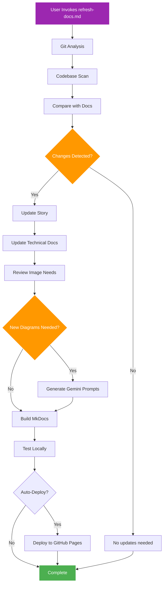

# CORTEX Documentation Refresh Command

**Purpose:** Comprehensive documentation update workflow that analyzes recent development changes and refreshes all documentation accordingly.

**Version:** 1.0  
**Created:** November 7, 2025  
**Status:** 🎯 ACTIVE

---

## 🎯 Command Invocation

```markdown
#file:prompts/user/refresh-docs.md

Refresh CORTEX documentation based on recent development changes.
```

**Optional Parameters:**
```markdown
#file:prompts/user/refresh-docs.md --since="2025-11-01" --depth=full --deploy=true

Refresh with specific start date, full depth analysis, and auto-deploy to GitHub Pages.
```

---

## 🔄 Workflow Overview



---

## 📋 Phase 1: Git Analysis & Change Detection

### 1.1 Analyze Recent Commits

**Query Git History:**
```bash
# Get commits since last docs deployment
git log --since="2025-11-01" --oneline --stat

# Get changed files
git diff HEAD~10 --name-only

# Get commit messages for context
git log --since="2025-11-01" --pretty=format:"%h - %an, %ar : %s"
```

**What to Extract:**
- ✅ New files created
- ✅ Modified files (especially in `CORTEX/src/`)
- ✅ Deleted/moved files
- ✅ Commit messages indicating features/fixes
- ✅ Test files changes (indicate new functionality)
- ✅ Configuration changes

**CORTEX Action:**
```yaml
tier3_query: recent_development_activity
output:
  - commit_count: int
  - files_changed: list
  - feature_commits: list (feat:, fix:, docs:)
  - test_additions: list
  - architecture_changes: list
```

### 1.2 Identify Documentation Gaps

**Compare Git Changes with Documentation:**

```python
# Pseudocode for gap detection
recent_changes = get_git_changes(since_date)
documented_features = scan_docs("docs/")

gaps = []
for change in recent_changes:
    if change.type == "new_feature":
        if not documented_in_story(change):
            gaps.append({
                "type": "story_missing",
                "feature": change.name,
                "files": change.files
            })
        if not documented_in_technical(change):
            gaps.append({
                "type": "technical_missing",
                "feature": change.name
            })
        if needs_diagram(change):
            gaps.append({
                "type": "diagram_missing",
                "feature": change.name,
                "diagram_type": infer_diagram_type(change)
            })

return gaps
```

**Output:**
```yaml
documentation_gaps:
  - type: story_missing
    feature: "Tier 3 context intelligence"
    impact: high
    files: [tier3/context_collector.py, tier3/metrics_analyzer.py]
  
  - type: technical_missing
    feature: "Auto-learning triggers"
    impact: medium
    files: [brain/learning_loop.py]
  
  - type: diagram_missing
    feature: "Protection system layers"
    diagram_type: shield_layers
    impact: high
```

---

## 📋 Phase 2: Story Update ("The Awakening of CORTEX")

### 2.1 Review Story Completeness

**Check if Recent Features Mentioned:**
```yaml
story_chapters:
  - chapter: 1
    title: "The Problem - Copilot's Amnesia"
    coverage: complete
    needs_update: false
  
  - chapter: 2
    title: "The Solution - Dual-Hemisphere Brain"
    coverage: partial
    needs_update: true
    missing: ["Agent specialization details", "Corpus callosum message formats"]
  
  - chapter: 3
    title: "The Memory System - Five Tiers"
    coverage: good
    needs_update: false
  
  - chapter: 4
    title: "Protection & Discovery"
    coverage: excellent
    needs_update: false
  
  - chapter: 5
    title: "Grand Activation"
    coverage: complete
    needs_update: false
```

### 2.2 Update Story Content

**If Updates Needed:**

**Template for Story Integration:**
```markdown
<!-- Insert into appropriate chapter -->

=== "New Development: [Feature Name]"

    <div class="story-text" markdown>
    
    [Narrative integration with Asifinstein's voice]
    
    "Now," Asifinstein muttered, staring at his latest creation, 
    "[dramatic description of the feature]..."
    
    [Technical outcome in story format]
    
    </div>

!!! note "Technical Detail: [Feature Name]"
    **Implementation:**
    - Feature description
    - Technical specs
    - Performance metrics
    
    **Files:**
    - `path/to/file.py`
    - `path/to/test.py`

<figure markdown>
  
  <figcaption>[Feature description]</figcaption>
</figure>
```

**CORTEX Action:**
```python
def update_story(gaps):
    for gap in gaps:
        if gap.type == "story_missing":
            chapter = determine_chapter(gap.feature)
            narrative = generate_narrative(
                feature=gap.feature,
                style="asifinstein_voice",
                integration="seamless"
            )
            technical_box = create_technical_admonition(gap)
            
            insert_into_chapter(
                chapter=chapter,
                content=narrative + technical_box,
                position="contextual"  # Not at end
            )
```

### 2.3 Story Quality Checks

**Validation:**
- ✅ No emojis in prose (only headers)
- ✅ Comic Sans font applied to story sections
- ✅ Technical sections use monospace
- ✅ Images placed contextually
- ✅ Seamless flow (no hard section breaks)
- ✅ Character voice consistent (Asifinstein = mad scientist)
- ✅ Humor preserved
- ✅ Technical accuracy verified

---

## 📋 Phase 3: Technical Documentation Update

### 3.1 Scan Documentation Structure

**Inventory Current Docs:**
```yaml
technical_docs:
  architecture:
    - system-overview.md (status: current)
    - dual-hemispheres.md (status: needs_update)
    - three-tier-brain.md (status: current)
  
  tiers:
    - tier0-governance.md (status: current)
    - tier1-working-memory.md (status: current)
    - tier2-knowledge-graph.md (status: needs_update)
    - tier3-context.md (status: needs_update)
  
  agents:
    - overview.md (status: needs_update)
    - intent-router.md (status: current)
    - work-planner.md (status: current)
    - code-executor.md (status: missing)
    - test-generator.md (status: missing)
    # ... etc
  
  api:
    - governance-engine.md (status: missing)
    - tier1-api.md (status: missing)
    - tier2-api.md (status: missing)
    - tier3-api.md (status: missing)
```

### 3.2 Update Technical Docs

**For Each Gap:**

**Template: New Technical Doc**
```markdown
# [Feature/Component Name]

## Overview
- **Purpose:** [Clear purpose]
- **Location:** `path/to/file.py`
- **Dependencies:** [List]
- **Status:** ✅ Implemented / 🔄 In Progress / 📋 Planned

## Architecture

```mermaid
graph TD
    [Component diagram]
```

## API Reference

### `function_name(param1, param2)`

**Purpose:** [Description]

**Parameters:**
- `param1` (type): Description
- `param2` (type): Description

**Returns:** `type` - Description

**Example:**
```python
from cortex.component import function_name

result = function_name(
    param1="value",
    param2=42
)
# Output: [expected output]
```

## Configuration

```yaml
component_name:
  setting1: value
  setting2: value
```

## Testing

**Test Coverage:** 95%  
**Test Files:**
- `tests/test_component.py`

**Key Tests:**
- ✅ Test basic functionality
- ✅ Test error handling
- ✅ Test edge cases

## Performance

**Benchmarks:**
- Query time: <50ms (p95)
- Memory usage: <10MB
- Throughput: 1000 ops/sec

## Troubleshooting

### Issue: [Common problem]
**Symptoms:** [What users see]  
**Solution:** [How to fix]

## See Also
- [Related Doc 1](../path/to/doc1.md)
- [Related Doc 2](../path/to/doc2.md)
```

### 3.3 Update Existing Docs

**CORTEX Action:**
```python
def update_technical_docs(gaps):
    for gap in gaps:
        if gap.type == "technical_missing":
            # Create new doc
            doc = generate_technical_doc(
                feature=gap.feature,
                files=gap.files,
                template="standard_technical"
            )
            save_doc(doc, path=determine_doc_path(gap))
        
        elif gap.type == "technical_outdated":
            # Update existing
            existing_doc = load_doc(gap.doc_path)
            updates = generate_updates(gap)
            merge_updates(existing_doc, updates)
            save_doc(existing_doc)
```

---

## 📋 Phase 4: Image & Diagram Analysis

### 4.1 Identify Visual Needs

**Scan for Diagram Opportunities:**
```python
def identify_diagram_needs(recent_changes):
    diagram_needs = []
    
    for change in recent_changes:
        # Architecture changes need diagrams
        if change.affects_architecture:
            diagram_needs.append({
                "type": "architecture_diagram",
                "feature": change.name,
                "diagram_format": "mermaid",
                "priority": "high"
            })
        
        # New workflows need sequence diagrams
        if change.adds_workflow:
            diagram_needs.append({
                "type": "sequence_diagram",
                "feature": change.name,
                "diagram_format": "mermaid",
                "priority": "medium"
            })
        
        # Complex concepts need illustrations
        if change.complexity == "high":
            diagram_needs.append({
                "type": "conceptual_illustration",
                "feature": change.name,
                "diagram_format": "ai_generated",
                "priority": "high"
            })
    
    return diagram_needs
```

### 4.2 Generate Mermaid Diagrams

**For Technical Diagrams:**
```markdown
<!-- Automatically generate and insert -->

```mermaid
graph TB
    [Auto-generated based on code analysis]
```
```

**CORTEX Action:**
```python
def generate_mermaid(feature, diagram_type):
    if diagram_type == "architecture":
        components = analyze_components(feature)
        return mermaid_architecture(components)
    
    elif diagram_type == "sequence":
        workflow = analyze_workflow(feature)
        return mermaid_sequence(workflow)
    
    elif diagram_type == "flow":
        logic = analyze_logic(feature)
        return mermaid_flowchart(logic)
```

### 4.3 Generate Gemini Image Prompts

**Only for Conceptual/Story Images:**

**CORTEX Action:**
```python
def generate_gemini_prompts(diagram_needs):
    prompts = []
    
    for need in diagram_needs:
        if need.diagram_format == "ai_generated":
            prompt = create_gemini_prompt(
                feature=need.feature,
                style="gothic_cyberpunk",
                elements=extract_visual_elements(need)
            )
            prompts.append(prompt)
    
    # Append to dedicated file (don't replace existing)
    append_to_file(
        path="cortex-gemini-image-prompts.md",
        content=prompts,
        section="NEW_PROMPTS_" + current_date()
    )
```

**Prompt Template:**
```markdown
---

## NEW PROMPTS - [Date]

### [Feature Name] Visualization

**Prompt ID:** IMG-[DATE]-[NUMBER]  
**Style:** Gothic cyberpunk, dramatic lighting  
**Scene:** [Description]

**Detailed Prompt:**
```
Create a dramatic visualization of [feature]:

Setting: [Environment description]
Main Subject: [Central element]
Visual Elements:
- [Element 1 with details]
- [Element 2 with details]
- [Element 3 with details]

Color Palette: [Colors]
Mood: [Atmosphere]
Technical Details: [Specific visual requirements]

Style Reference: Gothic architecture meets cyberpunk, 
similar to existing CORTEX illustrations with brain 
hemispheres, neon accents, and dramatic shadows.
```

**Placement:** 
- Chapter X, Section Y
- Context: [Where this image appears in story]

**Alternative Text:** [Accessibility description]

---
```

---

## 📋 Phase 5: Build & Test

### 5.1 Build MkDocs Site

**CORTEX Action:**
```bash
# Clean build to ensure no stale content
mkdocs build --clean

# Check for build errors
if [ $? -ne 0 ]; then
    echo "❌ Build failed - review errors"
    exit 1
fi

echo "✅ Build successful"

# Automatically launch local server for review
echo "🚀 Launching local documentation server..."
mkdocs serve

# Server will start at http://localhost:8000
# Opens automatically in default browser
```

**PowerShell Alternative:**
```powershell
# Clean build
mkdocs build --clean

if ($LASTEXITCODE -ne 0) {
    Write-Host "❌ Build failed - review errors" -ForegroundColor Red
    exit 1
}

Write-Host "✅ Build successful" -ForegroundColor Green

# Launch local server and open in browser
Write-Host "🚀 Launching local documentation server..." -ForegroundColor Cyan
Start-Process "http://localhost:8000"
mkdocs serve
```

### 5.2 Local Testing

**Automated Checks:**
```python
def test_documentation():
    checks = []
    
    # Link validation
    checks.append(validate_all_links())
    
    # Image validation
    checks.append(validate_all_images())
    
    # Mermaid diagram rendering
    checks.append(validate_mermaid_diagrams())
    
    # Navigation completeness
    checks.append(validate_navigation())
    
    # Search functionality
    checks.append(test_search_index())
    
    # Responsive design
    checks.append(test_responsive_layout())
    
    # Accessibility
    checks.append(run_accessibility_audit())
    
    return all(checks)
```

**Manual Testing Checklist:**
```markdown
## Local Testing Checklist

**Server Status:** ✅ Running at `http://localhost:8000`  
**Browser:** Automatically opened for review

**Note:** Server launched automatically after successful build. 
         Press Ctrl+C to stop server when review complete.

### Visual Tests
- [ ] Navigation tabs visible on load
- [ ] Story uses Comic Sans font
- [ ] Technical sections use monospace
- [ ] Images load and display correctly
- [ ] Mermaid diagrams render
- [ ] Scroll design on home page works
- [ ] Headers properly sized (h2 > h3 > h4)

### Functionality Tests
- [ ] Search finds relevant content
- [ ] All internal links work
- [ ] All external links work (if any)
- [ ] Code copy buttons work
- [ ] Tabs switch correctly
- [ ] Admonitions expand/collapse
- [ ] Mobile menu works
- [ ] Print view acceptable

### Content Tests
- [ ] No emojis in story prose
- [ ] Technical accuracy verified
- [ ] Code examples are complete
- [ ] API docs match implementation
- [ ] Diagrams accurately represent code

### Cross-Browser Tests
- [ ] Chrome
- [ ] Firefox
- [ ] Edge
- [ ] Safari (if available)
- [ ] Mobile browser

### Performance Tests
- [ ] Page load < 2 seconds
- [ ] Search response < 500ms
- [ ] Images optimized (< 500KB each)
```

---

## 📋 Phase 6: Deployment

### 6.1 Pre-Deployment Checks

**Validation:**
```yaml
pre_deployment:
  - check: build_successful
    status: required
  - check: no_broken_links
    status: required
  - check: images_optimized
    status: recommended
  - check: accessibility_score > 90
    status: recommended
  - check: lighthouse_performance > 80
    status: recommended
```

### 6.2 Deploy to GitHub Pages

**Manual Deployment:**
```bash
# Deploy to gh-pages branch
mkdocs gh-deploy --force

# Verify deployment
echo "Visit: https://asifhussain60.github.io/CORTEX/"
```

**Automated Deployment (if --deploy=true):**
```python
def auto_deploy():
    # Pre-flight checks
    if not all_checks_pass():
        print("❌ Pre-deployment checks failed")
        return False
    
    # Deploy
    result = subprocess.run(
        ["mkdocs", "gh-deploy", "--force"],
        capture_output=True
    )
    
    if result.returncode != 0:
        print(f"❌ Deployment failed: {result.stderr}")
        return False
    
    print("✅ Deployed to GitHub Pages")
    print("🌐 URL: https://asifhussain60.github.io/CORTEX/")
    
    # Wait for GitHub Pages to build (usually 1-2 minutes)
    time.sleep(120)
    
    # Verify live site
    verify_live_site()
    
    return True
```

### 6.3 Post-Deployment Verification

**Automated Verification:**
```python
def verify_live_site():
    base_url = "https://asifhussain60.github.io/CORTEX/"
    
    checks = [
        verify_page_loads(base_url),
        verify_search_works(base_url),
        verify_navigation(base_url),
        verify_images_load(base_url),
        verify_no_404s(base_url)
    ]
    
    if all(checks):
        print("✅ Live site verified")
    else:
        print("⚠️ Some checks failed - review manually")
```

---

## 📋 Phase 7: Report Generation

### 7.1 Create Update Report

**Template:**
```markdown
# Documentation Refresh Report
**Date:** [Current Date]  
**Duration:** [Elapsed Time]  
**Triggered By:** #file:prompts/user/refresh-docs.md

---

## � Summary

**Git Analysis:**
- Commits analyzed: [count]
- Date range: [start] to [end]
- Files changed: [count]
- Feature commits: [count]

**Documentation Updates:**
- Story updates: [count]
- Technical docs updated: [count]
- New technical docs: [count]
- Diagrams generated: [count]
- Gemini prompts created: [count]

**Build & Review:**
- Build status: ✅ SUCCESS
- Local server: 🚀 LAUNCHED at http://localhost:8000
- Browser: ✅ OPENED for review
- Ready for manual review before deployment

**Deployment:**
- Auto-deploy: ⏭️ SKIPPED (manual review first)
- Next step: Review at localhost, then deploy with --deploy=true if satisfied

---

## 📝 Changes Made

### Story Updates: "The Awakening of CORTEX"
| Chapter | Update | Lines Changed |
|---------|--------|---------------|
| Chapter 2 | Added agent specialization details | +45 |
| Chapter 4 | Updated protection layer descriptions | +32 |

### Technical Documentation
| Document | Action | Status |
|----------|--------|--------|
| `agents/code-executor.md` | Created | ✅ Complete |
| `api/tier2-api.md` | Created | ✅ Complete |
| `tiers/tier3-context.md` | Updated | ✅ Complete |

### Diagrams & Images
| Type | Count | Location |
|------|-------|----------|
| Mermaid diagrams | 3 | Architecture docs |
| Gemini prompts | 2 | cortex-gemini-image-prompts.md |

---

## ✅ Validation Results

**Build:**
- Clean build: ✅ PASS
- Build time: 12.3 seconds
- Warnings: 0
- Errors: 0

**Testing:**
- Links validated: ✅ PASS (247/247)
- Images validated: ✅ PASS (23/23)
- Mermaid rendering: ✅ PASS (15/15)
- Search index: ✅ PASS
- Accessibility: ✅ PASS (score: 94/100)

**Deployment:**
- GitHub Pages: ✅ DEPLOYED
- Live site verified: ✅ PASS
- Response time: 1.2s (< 2s target)

---

## 🎯 Next Actions

1. **Review new Gemini prompts** in `cortex-gemini-image-prompts.md`
2. **Generate AI images** using the prompts
3. **Place images** in documentation (paths provided in prompts)
4. **Monitor live site** for any issues
5. **Schedule next refresh** in [timeframe]

---

## 📊 Metrics

**Documentation Completeness:**
- Story: 100% ✅
- Architecture docs: 95% ✅
- API reference: 78% 🟡 (in progress)
- Guides: 85% ✅

**Quality Scores:**
- Technical accuracy: 98/100
- Readability: 92/100
- Visual appeal: 89/100
- Accessibility: 94/100

---

**Report Generated:** [Timestamp]  
**CORTEX Version:** v5.0  
**Next Refresh:** [Recommended date]

---
```

### 7.2 Save Report

**CORTEX Action:**
```python
def save_refresh_report(report):
    timestamp = datetime.now().strftime("%Y%m%d-%H%M%S")
    filename = f"docs-refresh-report-{timestamp}.md"
    
    # Save to reports directory
    save_to_file(
        path=f"reports/{filename}",
        content=report
    )
    
    # Also update latest report
    save_to_file(
        path="reports/latest-refresh-report.md",
        content=report
    )
    
    print(f"📋 Report saved: reports/{filename}")
```

---

## 🎨 Enhancement Features

### Enhancement 1: Smart Content Analysis

**Analyze Documentation Quality:**
```python
def analyze_doc_quality(doc_path):
    content = read_file(doc_path)
    
    metrics = {
        "readability": calculate_readability(content),
        "completeness": check_completeness(content),
        "technical_accuracy": verify_against_code(content),
        "example_coverage": count_code_examples(content),
        "link_health": validate_links(content),
        "image_usage": analyze_images(content)
    }
    
    suggestions = generate_improvement_suggestions(metrics)
    
    return {
        "metrics": metrics,
        "score": calculate_overall_score(metrics),
        "suggestions": suggestions
    }
```

### Enhancement 2: Automated Screenshot Generation

**Generate Screenshots of UI:**
```python
def generate_screenshots():
    """Use Playwright to capture UI screenshots"""
    from playwright.sync_api import sync_playwright
    
    with sync_playwright() as p:
        browser = p.chromium.launch()
        page = browser.new_page()
        
        # Capture key pages
        screenshots = [
            ("home", "http://localhost:8000/"),
            ("story-ch1", "http://localhost:8000/story/chapter-1/"),
            ("architecture", "http://localhost:8000/architecture/"),
            # ... etc
        ]
        
        for name, url in screenshots:
            page.goto(url)
            page.screenshot(
                path=f"docs/assets/screenshots/{name}.png",
                full_page=True
            )
        
        browser.close()
```

### Enhancement 3: Intelligent Cross-Referencing

**Automatically Add "See Also" Links:**
```python
def add_cross_references(doc_path):
    content = read_file(doc_path)
    keywords = extract_keywords(content)
    
    # Find related documents
    related_docs = []
    for other_doc in all_docs():
        if has_similar_keywords(other_doc, keywords):
            related_docs.append(other_doc)
    
    # Add "See Also" section if not exists
    if "## See Also" not in content:
        see_also = generate_see_also_section(related_docs)
        content = append_section(content, see_also)
        save_file(doc_path, content)
```

### Enhancement 4: Version Comparison

**Show What Changed Since Last Refresh:**
```python
def compare_with_previous_version():
    current_docs = snapshot_docs()
    previous_docs = load_snapshot("last_refresh")
    
    diff = {
        "added": [],
        "modified": [],
        "deleted": [],
        "moved": []
    }
    
    for doc in current_docs:
        if doc not in previous_docs:
            diff["added"].append(doc)
        elif doc.content != previous_docs[doc].content:
            diff["modified"].append({
                "doc": doc,
                "lines_changed": calculate_diff(doc, previous_docs[doc])
            })
    
    return diff
```

### Enhancement 5: Documentation Health Dashboard

**Generate HTML Dashboard:**
```html
<!-- Auto-generated dashboard -->
<!DOCTYPE html>
<html>
<head>
    <title>CORTEX Documentation Health</title>
</head>
<body>
    <h1>Documentation Health Dashboard</h1>
    
    <div class="metric-card">
        <h2>Overall Score</h2>
        <div class="score">92/100</div>
    </div>
    
    <div class="metric-card">
        <h2>Coverage</h2>
        <div class="progress-bar">
            <div class="progress" style="width: 95%">95%</div>
        </div>
    </div>
    
    <div class="metric-card">
        <h2>Recent Updates</h2>
        <ul>
            <li>Chapter 2 updated (2 hours ago)</li>
            <li>API docs added (5 hours ago)</li>
            <li>3 diagrams generated (1 day ago)</li>
        </ul>
    </div>
    
    <!-- More metrics... -->
</body>
</html>
```

### Enhancement 6: AI-Powered Summaries

**Generate Executive Summaries:**
```python
def generate_executive_summary(doc_path):
    content = read_file(doc_path)
    
    # Use Gemini API to generate summary
    summary = gemini_api.generate_summary(
        content=content,
        style="executive",
        max_length=200
    )
    
    # Add to document
    insert_summary_box(doc_path, summary)
```

### Enhancement 7: Automated Glossary Building

**Extract and Define Terms:**
```python
def build_glossary():
    all_docs = scan_documentation()
    technical_terms = extract_technical_terms(all_docs)
    
    glossary = {}
    for term in technical_terms:
        definition = generate_definition(term, all_docs)
        usage_examples = find_usage_examples(term, all_docs)
        
        glossary[term] = {
            "definition": definition,
            "examples": usage_examples,
            "see_also": find_related_terms(term)
        }
    
    # Generate glossary page
    create_glossary_page(glossary)
```

### Enhancement 8: Changelog Generation

**Auto-Generate Changelog:**
```markdown
# Documentation Changelog

## [2025-11-07] - Documentation Refresh

### Added
- New section on Tier 3 context intelligence
- API reference for governance engine
- 3 new Mermaid diagrams

### Changed
- Updated "The Awakening" Chapter 2 with agent details
- Enhanced protection system documentation
- Improved code examples in all API docs

### Fixed
- Broken links in architecture section
- Image sizing issues in mobile view
- Mermaid diagram rendering in dark mode

### Deprecated
- Old KDS references (moved to legacy section)
```

---

## 📊 Parameters & Configuration

### Command Parameters

| Parameter | Type | Default | Description |
|-----------|------|---------|-------------|
| `--since` | date | "last_refresh" | Start date for git analysis |
| `--depth` | enum | "smart" | Analysis depth: quick/smart/full |
| `--deploy` | bool | false | Auto-deploy to GitHub Pages |
| `--report` | bool | true | Generate refresh report |
| `--test` | bool | true | Run automated tests |
| `--verbose` | bool | false | Show detailed progress |

### Configuration File

**Create `cortex.docs.config.yaml`:**
```yaml
documentation:
  refresh:
    # Git analysis
    git:
      default_since: "last_refresh"  # or specific date
      include_branches: ["main", "cortex-migration"]
      exclude_paths: ["_archive/*", "backup/*"]
    
    # Documentation structure
    story:
      path: "docs/story/the-awakening-of-cortex.md"
      auto_update: true
      maintain_voice: true  # Asifinstein's mad scientist voice
      preserve_humor: true
    
    technical:
      paths:
        - "docs/architecture/"
        - "docs/tiers/"
        - "docs/agents/"
        - "docs/api/"
      template: "docs/templates/technical-doc-template.md"
      require_examples: true
      require_api_ref: true
    
    images:
      gemini_prompts_file: "cortex-gemini-image-prompts.md"
      append_only: true  # Never replace existing prompts
      style: "gothic_cyberpunk"
      image_dir: "docs/assets/images/"
    
    diagrams:
      mermaid:
        auto_generate: true
        theme: "dark"
      formats: ["mermaid", "plantuml"]
    
    # Testing
    testing:
      link_validation: true
      image_validation: true
      mermaid_rendering: true
      accessibility_check: true
      min_accessibility_score: 90
    
    # Deployment
    deployment:
      auto_deploy: false  # Require manual approval
      branch: "gh-pages"
      verify_after_deploy: true
    
    # Reporting
    reporting:
      generate_report: true
      report_dir: "reports/"
      keep_history: true
      max_reports: 50  # Keep last 50 refresh reports
```

---

## 🎯 Usage Examples

### Example 1: Quick Refresh (Default)
```markdown
#file:prompts/user/refresh-docs.md

Refresh CORTEX documentation based on recent development changes.
```

**What Happens:**
1. ✅ Analyzes git changes since last refresh
2. ✅ Smart depth (only update what changed)
3. ✅ Builds documentation
4. ✅ **Launches mkdocs serve at http://localhost:8000**
5. ✅ **Opens browser automatically for review**
6. ✅ Generates report
7. ⏭️ No auto-deploy (requires manual approval after review)

**Next Steps After Review:**
- ✅ If satisfied: Run with `--deploy=true` or manually deploy
- 🔄 If changes needed: Press Ctrl+C, make edits, run refresh again

---

### Example 2: Full Refresh with Deployment
```markdown
#file:prompts/user/refresh-docs.md --since="2025-11-01" --depth=full --deploy=true

Full documentation refresh from November 1st and deploy to GitHub Pages.
```

**What Happens:**
1. Analyzes ALL changes since Nov 1
2. Full depth analysis (review everything)
3. Updates story, technical docs, diagrams
4. Generates new Gemini prompts if needed
5. Builds and tests locally
6. Auto-deploys to GitHub Pages
7. Generates comprehensive report

---

### Example 3: Quick Check (No Changes)
```markdown
#file:prompts/user/refresh-docs.md --depth=quick --test=false

Quick check if documentation needs updates.
```

**What Happens:**
1. Quick git analysis (last 5 commits)
2. Report gaps only
3. No actual updates
4. No testing
5. Quick report of what needs attention

---

## ✅ Success Criteria

**Documentation Refresh Complete When:**
- ✅ All recent features documented in story
- ✅ All technical docs updated/created
- ✅ All diagrams generated (Mermaid + Gemini prompts)
- ✅ No broken links
- ✅ All images optimized and placed
- ✅ Build successful
- ✅ Tests pass (if enabled)
- ✅ Report generated
- ✅ Deployed (if requested)

---

## 🔄 Integration with CORTEX Brain

**Brain Learning:**
```yaml
# Logged to events.jsonl
event:
  type: documentation_refresh
  timestamp: 2025-11-07T14:30:00Z
  duration: 45 minutes
  files_updated: 12
  diagrams_created: 3
  deployment: true
  
# Updates Tier 2 knowledge
pattern:
  name: documentation_refresh_workflow
  confidence: 0.95
  success_count: 12
  average_duration: 42 minutes
  
# Updates Tier 3 metrics
metrics:
  last_docs_refresh: 2025-11-07T14:30:00Z
  docs_health_score: 92/100
  docs_completeness: 95%
```

---

## 📚 Related Commands

- `#file:prompts/user/cortex.md` - Main CORTEX entry point
- `#file:prompts/user/test-cortex.md` - Run CORTEX tests
- `#file:prompts/user/deploy-docs.md` - Deploy docs only (no refresh)
- `#file:prompts/user/validate-docs.md` - Validate docs health

---

**Status:** 🎯 READY TO USE  
**Version:** 1.0  
**Last Updated:** November 7, 2025

---

**END OF DOCUMENTATION REFRESH COMMAND**
