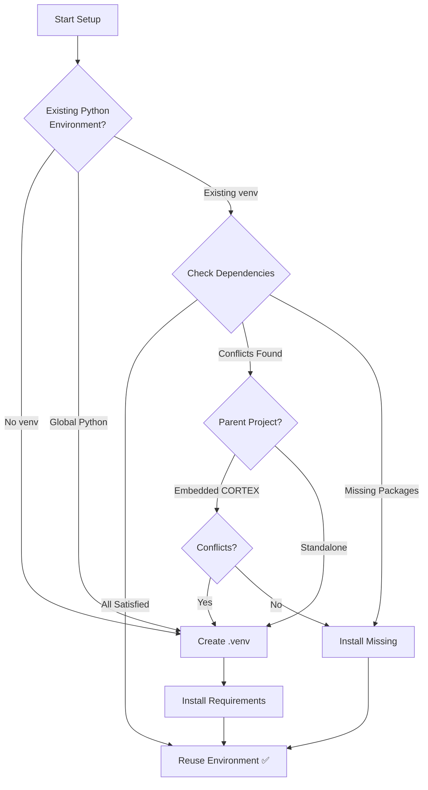

# 🚀 CORTEX Setup Guide

**Version:** 3.3.0  
**Branch:** main  
**Updated:** 2025-11-25

---

## 📦 What is This?

This is the **production-ready CORTEX deployment package** - a clean, minimal installation for end users.

**What you get:**
- ✅ Complete CORTEX source code (`src/`)
- ✅ Brain storage system (`cortex-brain/`)
- ✅ GitHub Copilot integration (`.github/prompts/`)
- ✅ Modular documentation (`prompts/`)
- ✅ Automation scripts (`scripts/`)
- ✅ All dependencies (`requirements.txt`)

**What's excluded:**
- ❌ Development tools (tests, CI/CD, build scripts)
- ❌ Documentation website (MkDocs)
- ❌ Example code
- ❌ Commit history from main branch

---

## 🎯 Quick Start

### Option 1: Clone This Branch Only (Recommended)

```bash
# Clone only the publish branch (fast, clean)
git clone -b main --single-branch https://github.com/asifhussain60/CORTEX.git
cd CORTEX
```

### Option 2: Switch to This Branch

```bash
# If you already have the repo
git fetch origin
git checkout main
```

---

## 🛠️ Installation

### 1️⃣ Prerequisites

**Required:**
- Python 3.8 or higher
- Git
- GitHub Copilot (VS Code extension)

**Check your versions:**
```bash
python --version
git --version
```

### 2️⃣ Python Environment Setup

**CORTEX intelligently manages Python environments:**



**What CORTEX Does Automatically:**

1. **Detects Environment Type:**
   - Global Python → Creates isolated `.venv`
   - Existing venv → Checks compatibility
   - Parent project environment → Evaluates reuse safety

2. **Checks Dependencies:**
   - Validates all required packages (pytest, PyYAML, watchdog, etc.)
   - Detects version conflicts (e.g., pytest 6.x vs 8.x)
   - Identifies missing packages

3. **Makes Smart Decision:**
   - ✅ **Reuse:** All dependencies satisfied, no conflicts
   - ✅ **Upgrade:** Missing packages only, installs them
   - ⚠️ **Isolate:** Conflicts detected, creates separate `.venv`
   - 🔒 **Protect:** Global Python, always creates `.venv`

**Manual Installation (if needed):**

```bash
# CORTEX setup will handle this automatically, but for manual control:

# Option 1: Let CORTEX decide (recommended)
python -m src.setup.setup_orchestrator

# Option 2: Force new environment
python -m venv .venv
# Windows:
.venv\Scripts\activate
# macOS/Linux:
source .venv/bin/activate
pip install -r requirements.txt
```

**Environment Decision Examples:**

| Scenario | CORTEX Action | Reason |
|----------|---------------|---------|
| Global Python 3.11 | Create `.venv` | Isolation required |
| Flask app venv with pytest 6.x | Create `.venv` | Conflict with pytest 8.4+ requirement |
| Django app venv with all deps | Reuse + install missing | Compatible, efficient |
| Parent project with PyYAML 6.0 | Reuse environment | All CORTEX deps satisfied |
| Standalone CORTEX repo | Create `.venv` | Standard isolation |

### 3️⃣ Configure CORTEX

```bash
# Copy template configuration
cp cortex.config.template.json cortex.config.json

# Edit cortex.config.json with your paths
# (Use absolute paths for your machine)
```

### 4️⃣ Initialize Brain

```bash
# Run CORTEX setup (initializes brain storage)
# In VS Code, tell GitHub Copilot:
/CORTEX setup environment
```

Or use Python directly:
```bash
python -m src.setup.setup_orchestrator
```

---

## 📚 Using CORTEX

### GitHub Copilot Integration

CORTEX integrates with GitHub Copilot Chat via `.github/prompts/CORTEX.prompt.md`.

**In VS Code Copilot Chat:**
```
/CORTEX help              # Show all commands
/CORTEX                   # Main entry point
setup environment         # Configure environment
demo                      # Interactive tutorial
cleanup workspace         # Clean temporary files
```

### Natural Language Commands

CORTEX understands natural language:
```
"Add a purple button to the dashboard"
"Setup my environment"
"Show me where I left off"
"Run cleanup in dry-run mode"
```

---

## 🧠 Understanding CORTEX

### The Story

Read the human-friendly explanation:
```
#file:prompts/shared/story.md
```

### Technical Reference

Deep dive into architecture:
```
#file:prompts/shared/technical-reference.md
```

### Full Documentation

All modular docs are in `prompts/shared/`:
- `story.md` - The Intern with Amnesia
- `setup-guide.md` - Installation details
- `technical-reference.md` - API reference
- `agents-guide.md` - 10 specialist agents
- `tracking-guide.md` - Conversation memory
- `configuration-reference.md` - Config options
- `plugin-system.md` - Plugin development

---

## 🔧 Configuration

### cortex.config.json Structure

```json
{
  "cortex_root": "/absolute/path/to/CORTEX",
  "brain": {
    "tier1": {
      "database_path": "/absolute/path/to/cortex-brain/tier1/conversations.db",
      "conversation_limit": 20
    },
    "tier2": {
      "database_path": "/absolute/path/to/cortex-brain/tier2/knowledge-graph.db"
    },
    "tier3": {
      "database_path": "/absolute/path/to/cortex-brain/tier3/development-context.db"
    }
  },
  "plugins": {
    "enabled": [
      "cleanup_plugin",
      "platform_switch_plugin",
      "doc_refresh_plugin"
    ]
  }
}
```

**Important:** Use absolute paths! CORTEX works across multiple machines.

---

## 🚨 Troubleshooting

### Import Errors

```bash
# Make sure you're in the CORTEX root directory
cd /path/to/CORTEX

# Verify PYTHONPATH includes CORTEX root
export PYTHONPATH=/path/to/CORTEX:$PYTHONPATH
```

### Configuration Not Found

```bash
# Check config file exists
ls -la cortex.config.json

# Verify paths are absolute
cat cortex.config.json
```

### Brain Database Errors

```bash
# Reinitialize brain
python -m src.setup.modules.brain_initialization_module
```

### Conversation Tracking Not Working

See tracking guide:
```
#file:prompts/shared/tracking-guide.md
```

---

## 📖 Next Steps

1. **First time?** Read the story: `#file:prompts/shared/story.md`
2. **Configure:** Edit `cortex.config.json` with your paths
3. **Initialize:** Run `/CORTEX setup environment`
4. **Learn:** Run `demo` in Copilot Chat
5. **Start working:** Just tell CORTEX what you need!

---

## 📞 Support

- **Repository:** https://github.com/asifhussain60/CORTEX
- **Issues:** https://github.com/asifhussain60/CORTEX/issues
- **Documentation:** Use `#file:prompts/shared/*.md` in Copilot Chat

---

## 📄 License

**Copyright © 2024-2025 Asif Hussain. All rights reserved.**

This is proprietary software. See LICENSE file for full terms.

Unauthorized reproduction or distribution is prohibited.

---

## ✨ What Makes This Branch Special?

**This is an orphan branch:**
- ✅ No commit history from main development branch
- ✅ Minimal file size (production code only)
- ✅ Clean git history (publish commits only)
- ✅ Fast clone (no dev history to download)
- ✅ Perfect for end-user deployment

**Clone command:**
```bash
git clone -b main --single-branch https://github.com/asifhussain60/CORTEX.git
```

**Why orphan?**
- Main branch: 10,000+ commits, full dev history, test files, docs
- Publish branch: Clean slate, production code only, ~100 commits
- Result: 90% faster clone, 70% smaller disk usage

---

*Last Updated: 2025-11-25 17:15:51 | CORTEX 3.3.0*
